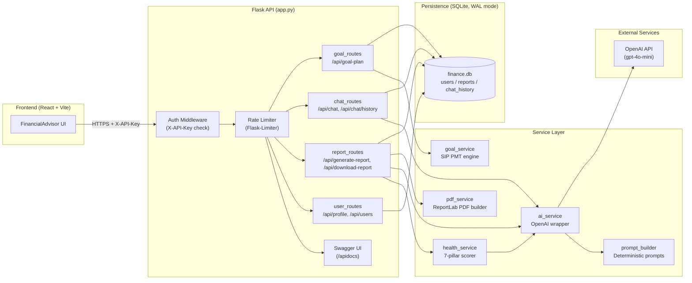
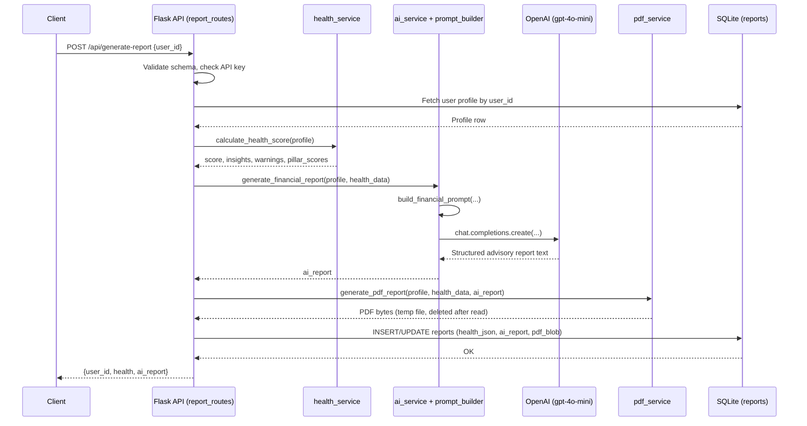
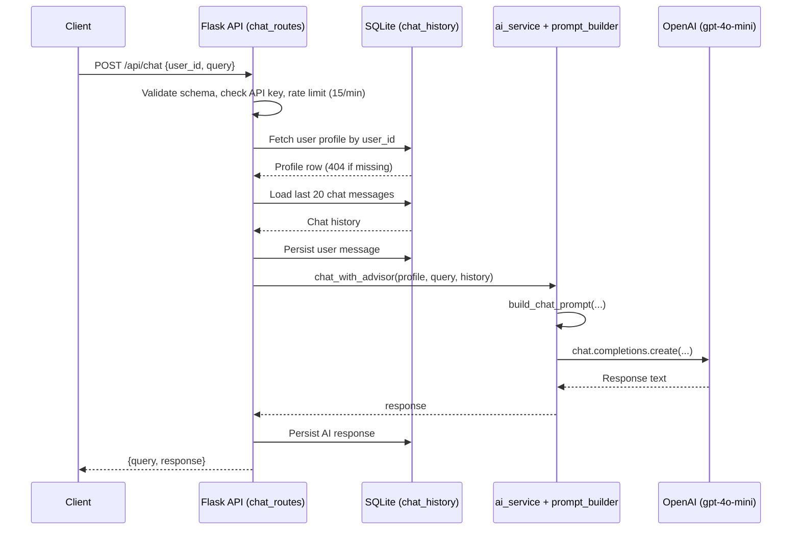
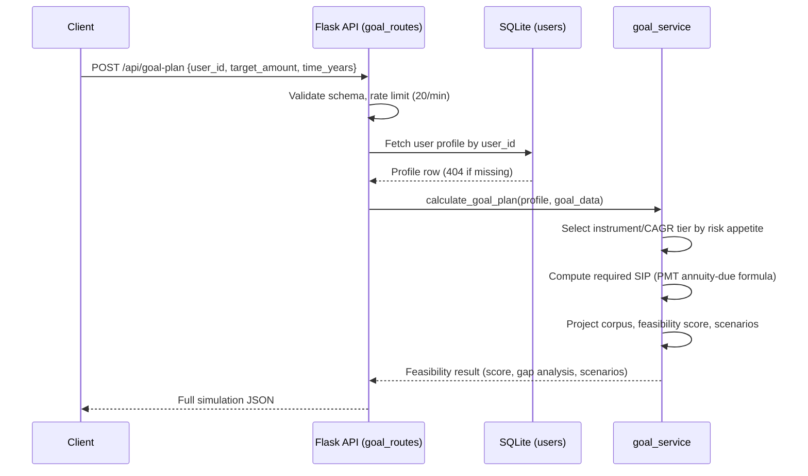

# FinPilot AI — AI-Powered Personal Financial Advisor

A production-oriented Flask backend that combines rule-based financial scoring engines with an LLM advisory layer (OpenAI GPT-4o-mini) to deliver personalized financial health assessments, AI-generated advisory reports, conversational financial guidance, and goal-feasibility simulations for Indian retail investors.

---

## Overview

FinPilot AI ingests a user's financial profile (income, expenses, savings, risk appetite, and goals), then layers three independent engines on top of it:

1. A **deterministic financial health scorer** (7 weighted pillars, 0-100 scale).
2. An **LLM advisory layer** that turns the scored profile into a structured, SEBI-advisor-style report and a conversational chat assistant.
3. A **goal feasibility simulator** built on SIP (Systematic Investment Plan) annuity-due mathematics, projecting Conservative / Balanced / Aggressive investment scenarios.

Reports are rendered to branded PDF documents, persisted to SQLite, and served through a fully documented, rate-limited, API-key-protected REST API with Swagger UI.

---

## Key Features

- **Financial Health Score** — 7-pillar rule-based scoring engine (savings rate, expense control, emergency fund, debt-to-income, retirement adequacy, tax efficiency, surplus buffer).
- **AI-Generated Advisory Reports** — structured, section-based reports generated via OpenAI, grounded in the user's actual numbers via a deterministic prompt builder.
- **Conversational Advisor Chat** — context-aware chat that references stored history and the user's financial profile, with persistent chat history per user.
- **Goal Feasibility Simulator** — SIP PMT-based required-contribution calculator with three CAGR scenarios, feasibility scoring, and recommended timelines.
- **PDF Report Generation** — branded, multi-section PDF advisory documents (cover page, snapshot, insights, warnings, AI recommendations, action checklist, disclaimer) via ReportLab.
- **Persistent Storage** — SQLite with WAL journaling, foreign-key enforcement, and indexed lookups for users, reports, and chat history.
- **API Security** — global `X-API-Key` header enforcement on all `/api/*` routes, with CORS scoped to the API namespace.
- **Rate Limiting** — per-route limits (e.g. 5/min for report generation, 15/min for chat, 20/min for goal simulation) via Flask-Limiter.
- **Swagger / OpenAPI Docs** — auto-generated interactive API documentation at `/apidocs/`.
- **Request Validation** — strict Marshmallow schemas for every mutating endpoint, with descriptive field-level error messages.
- **React + Vite Frontend** — a minimal client scaffold intended to consume the API (`frontend/`).

---

## Architecture



**Layer summary:**
1. Every request to `/api/*` (except OPTIONS and doc routes) passes through the `X-API-Key` auth check and the rate limiter before reaching a blueprint.
2. Route handlers validate incoming JSON against Marshmallow schemas, then delegate to the service layer.
3. `health_service` computes a deterministic 0-100 score; `goal_service` runs SIP projections; `ai_service` builds prompts via `prompt_builder` and calls OpenAI; `pdf_service` renders the final PDF.
4. All persistent state (profiles, reports, chat history) lives in SQLite, accessed through a shared connection helper with WAL journaling for concurrent reads.

---

## Sequence Diagrams

### 1. Generate Financial Report



### 2. Conversational Chat



### 3. Goal Feasibility Simulation



---

## Tech Stack

| Layer | Technology |
|---|---|
| Backend Framework | Flask, Flask-CORS, Flask-Limiter |
| API Documentation | Flasgger (Swagger UI) |
| Validation | Marshmallow |
| Database | SQLite (WAL mode, foreign keys enforced) |
| AI / LLM | OpenAI API (gpt-4o-mini) |
| PDF Generation | ReportLab |
| Frontend | React 19, Vite, ESLint |
| Config | python-dotenv |

---

## Project Structure

```
ai-financial-advisor/
├── app.py                       # App factory: CORS, auth middleware, rate limiter, Swagger, blueprints
├── config.py                    # Environment variable loading and validation
├── extensions.py                # Shared Flask-Limiter instance
├── schemas.py                   # Marshmallow request schemas (Profile, Report, Chat, GoalPlan)
├── requirements.txt             # Python dependencies
├── database/
│   ├── db.py                    # SQLite connection helper (WAL, foreign keys)
│   └── models.py                # Table creation (users, reports, chat_history) + indexes
├── models/
│   └── user_model.py            # UserProfile data class
├── routes/
│   ├── user_routes.py           # Profile CRUD (/api/profile, /api/users)
│   ├── report_routes.py         # Report generation, retrieval, PDF download
│   ├── chat_routes.py           # Chat, chat history retrieval/deletion
│   └── goal_routes.py           # Goal feasibility simulation endpoint
├── services/
│   ├── health_service.py        # 7-pillar financial health scoring engine
│   ├── goal_service.py          # SIP PMT math, scenario simulation, feasibility scoring
│   ├── ai_service.py            # OpenAI client wrapper, report + chat generation
│   ├── pdf_service.py           # ReportLab PDF report builder
│   └── profiling_service.py     # Standalone profile validation/normalization helpers
├── utils/
│   └── prompt_builder.py        # Deterministic, grounded prompt construction for the LLM
└── frontend/
    ├── src/
    │   ├── App.jsx               # Root component (renders FinancialAdvisor)
    │   ├── main.jsx              # React entry point
    │   └── App.css / index.css   # Styling
    ├── package.json
    ├── vite.config.js
    └── eslint.config.js
```

---

## Financial Health Scoring Model

The health score is computed across seven weighted pillars, totaling 100 points:

| Pillar | Max Points | Key Threshold |
|---|---|---|
| Savings rate | 25 | 30% of income or higher scores full marks |
| Expense control | 20 | Expenses at or below 50% of income scores full marks |
| Emergency fund | 20 | 6+ months of expenses covered scores full marks |
| Debt-to-income ratio | 15 | 20% or lower DTI scores full marks (if provided) |
| Retirement adequacy | 10 | Age-adjusted corpus projection against a 25x-annual-expense target |
| Tax efficiency | 5 | Estimated Section 80C utilization |
| Surplus buffer | 5 | Any positive monthly surplus |

Each pillar independently returns point contributions, human-readable insights, and warnings, which are aggregated and also fed into the LLM prompt builder for grounded report generation.

---

## Goal Feasibility Simulator

The simulator uses the standard SIP PMT (annuity-due) formula to compute the monthly contribution required to reach a target amount within a given horizon:

```
P = FV * r / [((1 + r)^n - 1) * (1 + r)]
```

Where `P` is the required monthly SIP, `FV` is the target amount, `r` is the monthly rate, and `n` is the number of months. The engine:

- Selects instrument recommendations and CAGR assumptions based on risk appetite and horizon (Low / Medium / High tiers).
- Produces Conservative, Balanced, and Aggressive scenario projections.
- Computes a rule-based feasibility score (0-100) from savings coverage, horizon bonus, and risk-alignment bonus.
- Binary-searches the recommended timeline to reach the goal at the current savings rate.

---

## API Reference

All endpoints below (except `/`, `/apidocs/`, and `/apispec.json`) require an `X-API-Key` header matching `API_SECRET_KEY`.

| Endpoint | Method | Rate Limit | Description |
|---|---|---|---|
| `/` | GET | — | Health check / service banner |
| `/apidocs/` | GET | — | Swagger UI |
| `/api/users` | GET | default | List all saved user profiles |
| `/api/profile` | POST | default | Create a new user profile |
| `/api/profile/<user_id>` | DELETE | default | Delete a profile and its associated report/chat history |
| `/api/generate-report` | POST | 5/min | Generate (or regenerate) an AI advisory report and PDF |
| `/api/report/<user_id>` | GET | default | Fetch a previously generated report |
| `/api/download-report/<user_id>` | GET | default | Download the stored PDF report |
| `/api/chat` | POST | 15/min | Send a message to the AI advisor |
| `/api/chat/history/<user_id>` | GET | default | Fetch stored chat history |
| `/api/chat/history/<user_id>` | DELETE | default | Clear chat history for a user |
| `/api/goal-plan` | POST | 20/min | Run the goal feasibility simulation |

Default rate limits (unless overridden per route): 200 requests/day, 60 requests/hour, per client IP.

---

## Getting Started

### Prerequisites

- Python 3.10+
- An OpenAI API key
- Node.js 18+ (for the frontend, optional)

### Backend Setup

```bash
git clone <repository-url>
cd ai-financial-advisor
pip install -r requirements.txt
```

Create a `.env` file in the project root:

```
OPENAI_API_KEY=your-openai-api-key
API_SECRET_KEY=your-chosen-api-secret
RATELIMIT_STORAGE_URI=memory://
```

Run the server:

```bash
python app.py
```

The API starts on `http://127.0.0.1:5000`. Interactive documentation is available at `http://127.0.0.1:5000/apidocs/`.

All `/api/*` requests must include the header:

```
X-API-Key: your-chosen-api-secret
```

### Frontend Setup

```bash
cd frontend
npm install
npm run dev
```

---

## Database Schema

| Table | Purpose | Key Constraints |
|---|---|---|
| `users` | Stores financial profiles | Primary key `id`, auto-incrementing |
| `reports` | Stores generated reports and PDF blobs | `user_id` unique, foreign key to `users`, cascading delete |
| `chat_history` | Stores per-user chat messages | Foreign key to `users`, cascading delete, `role` constrained to `user`/`ai` |

Indexes are created on `reports.user_id` and the composite `chat_history(user_id, id DESC)` to optimize the most frequent lookup and pagination patterns.

---

## Roadmap

- Migrate storage from SQLite to PostgreSQL for multi-instance deployments
- Add JWT-based per-user authentication in place of the shared API key
- Wire the React frontend to the full API surface (profile creation, chat, report download, goal simulator)
- Add automated test coverage for the scoring and simulation engines
- Support live market data for CAGR assumptions instead of static tiers

---

## Disclaimer

This system provides AI-assisted educational financial guidance and does not constitute regulated investment advice. Independent professional consultation is recommended before making investment decisions.

---

## Author

**Shantanu Garg**
B.Tech CSE-AI, Graphic Era (Deemed to be University), Dehradun
