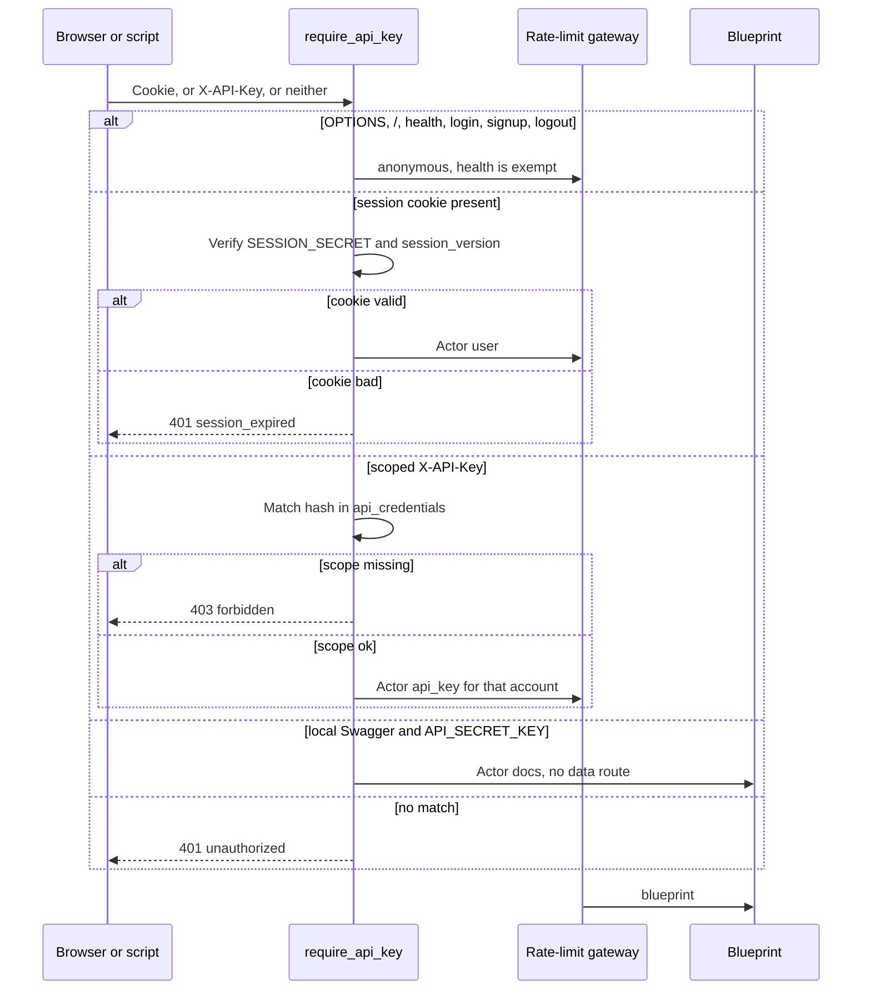

# FinPilot AI — as-built architecture

**Date:** 2026-09-27  
**Audience:** Someone who has not read the review. This file describes the process that is running after remediation issues 1–7.  
**Historical notes:** `docs/PLATFORM_QUALITY_WAVES.md` explains why older code looks the way it does. It is not the current system.

A browser signs in. The API stores the session in an HttpOnly cookie. Report and chat calls to Groq run in a separate worker process. Application data is PostgreSQL database `finpilot`. Rate-limit counters are PostgreSQL database `finpilot_ratelimit`. PDFs are files on disk.

Capacity, copied from `docs/testing_reports/REMEDIATION_6_LOAD_TEST_REPORT.md`: This host does not meet the written pass lines for 100 concurrent health checks or 100 concurrent profile lists. Report enqueue does. Eighty lists while 10 report jobs were running, and the chat gate after chat was queued, are both still over 300 ms. It is not fair to say that about 100 people can load the app and list their profiles at once, or that a report no longer freezes those reads.

---

## 1. Start the app

PostgreSQL comes up with Docker. The API and the worker are two processes. The React app is a third.

```bash
docker compose up -d
python app.py
python -m services.jobs.worker
```

Frontend, from `frontend/`:

```bash
npm install
npm run dev
```

The Vite server is `http://localhost:5173` and proxies `/api` to `http://127.0.0.1:5000`, so the session cookie stays on one origin. Sign in from the landing page.

Required environment names (values live in `.env`, never in this file): `GROQ_API_KEY`, `API_SECRET_KEY`, `SESSION_SECRET`. `SESSION_SECRET` signs `finpilot_session`. It must be at least 32 characters and different from `API_SECRET_KEY`. Changing it signs every browser out.

`APP_DATABASE_URL` points at database `finpilot`. `RATELIMIT_DATABASE_URL` points at `finpilot_ratelimit`. `RATELIMIT_STORAGE_BACKEND=sql` turns on the gateway. `FLASK_ENV=development` turns Swagger on at `http://127.0.0.1:5000/apidocs/`.

`API_SECRET_KEY` is the local Swagger password (HTTP Basic, any username). It does not open profiles, reports, chat, or goals. A script that must call those routes uses a scoped key from `python scripts/issue_api_credential.py`. The script prints the raw key once. The database stores a hash.

`SQLITE_IMPORT` defaults off. A normal start does not open a SQLite file. Set it only to copy an old `finance.db` into an empty `public` schema.

`BOOTSTRAP_ACCOUNT_EMAIL` and `BOOTSTRAP_ACCOUNT_PASSWORD` are required only when existing profiles have no `account_id`. Startup then attaches those profiles to one account. The password is stored as a hash.

The web process can also be Waitress or Gunicorn. Thread and timeout numbers are in `docs/CAPACITY_RUNBOOK.md`. The Groq worker is still `python -m services.jobs.worker` beside that process. Waitress is a host tool. It is not in `requirements.txt`.

---

## 2. Request path

`app.py` `require_api_key` then `enforce_rate_limit`, then the blueprint. `services/actor.py` `resolve_actor` is the only place a request becomes an actor.



Order inside `resolve_actor`:

1. A presented `finpilot_session` cookie is resolved first. A bad cookie does not fall through to a key.
2. Else `X-API-Key` (or the Swagger Basic password) is matched to a non-revoked row in `api_credentials`. The actor is `api_key`. `credential` is that account id. `scopes` is `data`, `llm`, or both.
3. Else, on local `/apidocs/` and `/apispec.json` only, a value equal to `API_SECRET_KEY` is `docs`.
4. Else the request is rejected.

`GET /api/auth/me` still requires `kind=user`. A scoped key is not a browser session.

Data routes need scope `data`. `POST /api/generate-report` and `POST /api/chat` need scope `llm`. A browser session is not checked for scopes. A scoped key without the scope is `403` `forbidden`. An unmatched key is `401` `unauthorized`.

The gateway in `services/rate_limit` is the live limiter when `RATELIMIT_STORAGE_BACKEND` is `sql` or `memory`. Flask-Limiter stays imported and its decorators stay on routes, and `limiter.enabled` is false on that path so the two do not both count. Unknown `/api` paths return `429` `rate_policy_missing`. Health is exempt.

Logout (`routes/auth_routes.py`) increments `accounts.session_version` and clears the cookie. Older cookies fail on the next request.

---

## 3. Report job and chat job

Groq does not run inside the HTTP request. `routes/report_routes.py` and `routes/chat_routes.py` insert a row. `services/jobs/worker.py` claims it.

| Step | File | What happens |
| --- | --- | --- |
| Enqueue report | `database/repository.py` `enqueue_report_job` | Inserts `jobs.kind = 'report'`, status `queued`. A second click while that profile already has a queued or running report returns the same job. |
| Enqueue chat | `enqueue_chat_job` | Inserts `kind = 'chat'` and stores the query in `payload`. Many chats may be queued. |
| Claim | `claim_next_report_job` | `FOR UPDATE SKIP LOCKED` on the oldest queued report or chat. Status becomes `running`. |
| Report work | `_run_report` | Scores health, calls Groq, saves the advisory text, then writes the PDF. Text is saved before the PDF. A PDF failure still marks the job `succeeded`. A Groq failure marks it `failed`. |
| Chat work | `_run_chat` | Calls Groq, then `save_chat_turn`. A failed chat is not stored. |
| Stale claim | `fail_stale_report_jobs` | A `running` row older than `WORKER_TIMEOUT_SECONDS` (default 120) becomes `failed` with `error_code` `worker_lost`. |

`POST /api/generate-report` returns `202` `{"job_id", "status"}`. `POST /api/chat` returns `202` `{"query", "job_id", "status"}`. Rate limits stay on that enqueue request.

`GET /api/report/<id>` (`get_stored_report`) returns the stored report when one exists. It adds `job` when the newest report job is `queued`, `running`, or `failed`. A `succeeded` job is omitted, because the stored report is the result. The same rule is on `GET /api/chat/history/<id>` for the newest chat job.

The React report hook polls that GET about every 2 seconds. The chat hook polls history about every 1 second. Both stop around 120 seconds.

---

## 4. Data

| Store | What it holds | Where it is set |
| --- | --- | --- |
| PostgreSQL database `finpilot` | Accounts, profiles, reports, chat, jobs, API credentials | `APP_DATABASE_URL`, pool in `database/db.py` |
| PostgreSQL database `finpilot_ratelimit` | Rate-limit buckets | `RATELIMIT_DATABASE_URL` |
| Directory `data/pdfs` | `profile_<user_id>.pdf` | `PDF_STORAGE_DIR` |

`database/models.py` `create_tables` creates the tables on startup (`CREATE TABLE IF NOT EXISTS`). There is no migration framework. `reports` stores `pdf_path`. It does not store PDF bytes. `jobs.kind` is `report` or `chat`.

Production uses schema `public`. `database/db.py` `schema_name()` documents the exception: a test sets `DB_NAME` to a throwaway path and gets schema `t_<hash>` inside database `finpilot_test`. That is test isolation, not a multi-tenant feature.

SQL under `database/` uses named binds (`:user_id`). `AppConnection.execute` accepts a dict. A tuple raises `DatabaseError`.

Ownership is `users.account_id` in `database/repository.py`. Reports and chats stay on `users.id`. A browser or a scoped key sees that account’s profiles. A mismatch is hidden as not found.

---

## 5. What is intentionally absent

- No Redis. Sessions are a signed cookie. Rate-limit state is PostgreSQL.
- No OAuth and no JWT access-token service. Login is email and password hashed in this app.
- No Alembic. Schema changes ship as `CREATE TABLE IF NOT EXISTS` and small `ALTER`s in `database/models.py`.
- Chat is queued. The issue 6 measurement showed a synchronous chat call holding the web process, so `POST /api/chat` now returns `202` and the worker calls Groq.
- The production browser does not send `VITE_API_KEY`. That variable is for local scripts only, and the env key is not a data actor.

Profile checks on the request path live in Marshmallow schemas. Prompts are built in `services/ai_service.py`.

---

## 6. Files

| File | Role |
| --- | --- |
| `app.py` | Factory, auth, gateway, health, blueprints |
| `services/actor.py` | Cookie, then scoped credential, then docs password |
| `services/sessions.py` | `finpilot_session` signed with `SESSION_SECRET` |
| `services/rate_limit/` | Quotas |
| `routes/auth_routes.py` | Signup, login, logout, `/api/auth/me` |
| `routes/report_routes.py` | Enqueue report, read report, download PDF |
| `routes/chat_routes.py` | Enqueue chat, read or clear history |
| `services/jobs/worker.py` | Claim and run Groq |
| `database/db.py` | Pool, named binds, test schema |
| `database/models.py` | Tables |
| `database/repository.py` | SQL and ownership |
| `database/pdf_files.py` | PDF files on disk |
| `scripts/issue_api_credential.py` | Issue or revoke a scoped key |
