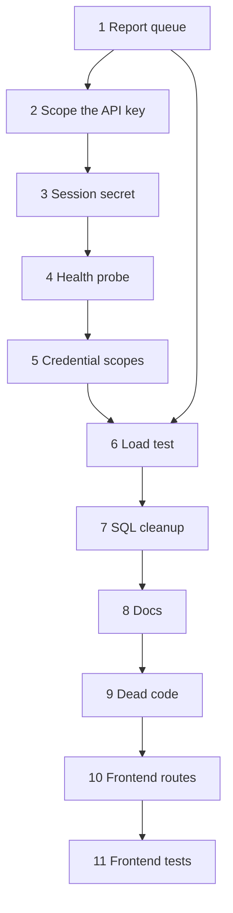

# Architecture remediation plan

**Status:** Plan only. Do not treat this file as permission to start coding.
**Date:** 2026-09-26
**Baseline:** `main` at `7a8cc1f`
**Audience:** The next series of changes after the architecture review (overall 6.8 / 10).
**Inputs:** The review, plus the code those findings point at: `routes/report_routes.py`, `routes/chat_routes.py`, `database/repository.py`, `services/actor.py`, `services/sessions.py`, `app.py` health, `scripts/load_test_q6.py`, `docs/ARCHITECTURE.md`.

This document decides how each issue will be fixed and the order those fixes ship. It is not an implementation record. When a later issue is actually built, its test report still goes in `docs/testing_reports/`, the same way Q1–Q6 did.

---

## 1. Judgment

The eleven issues are real. The proposed order is the right order for this codebase, with three rules that keep a later issue from undoing an earlier one.

1. **Issue 1 queues report generation only.** Chat stays on the request thread in that change. Issue 6 is not allowed to claim a mixed read-plus-chat workload until a measured chat run says the threads are free enough. If that run fails, chat joins the same worker before any capacity claim. That is a gate on issue 6, not a silent expansion of issue 1.
2. **Issues 2 and 5 are one authorization model, shipped in two slices.** Issue 2 removes cross-account reads. Issue 5 adds a least-privilege credential. Issue 2 must not invent a temporary “key sees everything, but we log it” mode that issue 5 then deletes.
3. **Issue 2 does not rotate `API_SECRET_KEY`.** The session cookie is signed with that same value today (`services/sessions.py`). Rotation waits until issue 3 has a separate `SESSION_SECRET`. After issue 3, rotating the API key logs nobody out.

Nothing else moves. Health (4) stays in front of the load test (6). The SQL cleanup (7) stays behind the load test so a query rewrite is not mixed into the capacity number. Documentation (8) describes the system after 1–7. Dead code (9) waits until those refactors have landed, because deleting `sqlite_import` or the PDF blob path earlier would fight issue 7. Frontend routes (10) land before frontend tests (11) so the tests cover the router that will exist.

### Why the queue is first, even though the key is a superuser

The browser does not send `X-API-Key`. Cross-account access requires that secret (Swagger, scripts, or a leaked `.env`). That is an operator credential, and it is unacceptable to leave in place, but it is not what every visitor holds.

Report generation is on the path the product actually uses. `POST /api/generate-report` calls Groq inside the handler (`routes/report_routes.py`), and `GROQ_TIMEOUT_SECONDS` is 90. Waitress was measured at 6 threads. A few live reports can occupy every thread that should be serving reads. That is the bottleneck in front of the 100-user goal, so it is issue 1.

### What this plan refuses

- Celery, RQ, Redis, or any new Python package for the queue. PostgreSQL is already the app database. One `jobs` table and `FOR UPDATE SKIP LOCKED` is enough for one worker and about 100 users.
- A larger Waitress thread pool as a substitute for the queue. Extra threads still block for the whole Groq call.
- OAuth or JWT. That decision was already made for Q5 and is unchanged.
- A full ORM rewrite of `database/repository.py` during the SQL cleanup.
- A claim of 100 concurrent users before issue 6 has a written pass line and a written result.
- Installing a frontend test runner or a router library during a later implementation until that install is explicitly approved. The designs below avoid a new package where a small amount of code will do.

---

## 2. Execution order

Each issue is one change, with its own pytest run and a testing report. Do not start the next issue because the previous one “mostly works.”

| Order | Issue | Ships when the previous issue is done | Depends on | Blocks |
| ----- | ----- | -------------------------------------- | ---------- | ------ |
| 1 | Report jobs | Start here | Postgres app database | Honest load test |
| 2 | Stop unscoped API-key reads | Issue 1 report is in | Cookie sessions from Q5 | Issue 5 |
| 3 | `SESSION_SECRET` | Issue 2 has not rotated the API key | None, other than that constraint | Safe rotation in issue 5 |
| 4 | App-database health | Independent of 2 and 3, but do it after 3 so the probe matches the secrets the process actually uses | App engine in `database/db.py` | Issue 6’s health line |
| 5 | Scoped API credentials | Issues 2 and 3 | Account id on the actor | Load-test client in issue 6 |
| 6 | Capacity measurement | Issues 1–5 | Worker process running | Any public “100 users” sentence |
| 7 | PostgreSQL-shaped SQL | Issue 6 report is written | Stable query behavior | Docs that describe SQL |
| 8 | Architecture docs | Issues 1–7 match the code | — | New contributors |
| 9 | Dead code and stale comments | Docs name the files that remain | — | — |
| 10 | Frontend paths | App shell still switches on `activePage` | No new package | Frontend tests |
| 11 | Frontend tests | Routes from issue 10 | Approval before any new devDependency | — |

### Go / no-go before issue 1

- `APP_DATABASE_URL` points at a reachable PostgreSQL. The worker and the web process must share that database.
- `GROQ_STUB` stays available so tests do not call Groq.
- No second person is relying on `POST /api/generate-report` returning the finished report in the same response. The only client in this repo is the React app, and it will be updated in the same issue.

If Postgres is down, stop. Do not build the queue against SQLite.

---

## 3. Issue 1 — Move report generation onto a job

### What is wrong

`generate_report` does four steps in the request: score, Groq, save text, build the PDF. The Groq step holds the worker for up to 90 seconds. `GET /api/report/<id>` has no notion of “in progress.” The frontend `useReport` sets `generating` and waits for that POST to finish (`frontend/src/hooks/useReport.js`).

Chat has the same shape (`routes/chat_routes.py` calls `chat_with_advisor` before it returns). It is called out here so nobody “helps” by queueing it in the same pull request. A chat reply is a conversational turn. Turning it into a poll changes the screen, the tests, and the rate-limit story. Measure it in issue 6. Queue it only if that measurement says reads are stuck behind chat.

### Options

| Option | Why it lost or won |
| ------ | ------------------ |
| More Waitress threads | Threads still sit inside Groq. Reads still queue behind them. |
| Celery or RQ plus Redis | A second store to run, back up, and watch. The job is one row and one worker. |
| Background thread inside Flask | Dies when the web process dies, and a dev `app.run` reload kills it. Hard to reason about in tests. |
| **Postgres job row, separate worker process** | Uses the database we already run. `SKIP LOCKED` is the lock. Tests can call one function instead of starting a process. |

### Design

Add a `jobs` table in the application database, created in `database/models.py` next to the other tables.

| Column | Role |
| ------ | ---- |
| `id` | Identity |
| `kind` | `report` for this issue. The column exists so a later chat job does not need a second table. |
| `account_id` | Owner copied from the actor at enqueue time |
| `user_id` | Profile the report is for |
| `status` | `queued`, `running`, `succeeded`, `failed` |
| `error_code`, `error_detail` | Set on failure. Detail is a short code path, not a prompt and not a traceback with secrets. |
| `attempts` | Incremented when a worker takes the row |
| `started_at`, `finished_at` | Stale-lock judgment |
| `created_at` | Order |

Rules:

- At most one `queued` or `running` report job per `user_id`. A second click returns that job with `202`. It does not start a second Groq call.
- The last successful `reports` row stays readable while a new job runs. A failure leaves that previous report in place.
- The worker checks `users.account_id` against `jobs.account_id` before it reads the profile or writes the report. The worker has no Flask request, so `repository._account_scope()` would return `None` and skip the owner filter. Issue 1 adds an explicit owner argument on the write path the worker uses. It does not rely on `g.actor`.
- Text is saved before the PDF, which is the current order in `generate_report`. A PDF failure still finishes the job as `succeeded` with `pdf_ready` false. That matches today’s soft-fail and must not become a hard failure.
- A row left in `running` longer than `WORKER_TIMEOUT_SECONDS` is marked `failed` with `worker_lost` the next time a worker looks at it. The person can generate again. There is no automatic second Groq call. A retry would double the provider spend and could double-write.
- Rate limits stay on the enqueue request (`llm_report` and `llm_report_user` in `services/rate_limit/policies.py`). Polling `GET /api/report/<id>` stays on the read quota. The worker does not consume another quota.

HTTP:

- `POST /api/generate-report` returns **202** and `{ "job_id", "status": "queued" }` (or the existing active job). It does not return the report body.
- `GET /api/report/<user_id>` keeps returning the stored report when one exists, and adds `job` when a `queued` or `running` job exists for that profile (`job_id`, `status`). A failed job with no stored report returns the failure code on that payload so the screen can show it. A failed job with an older report returns the old report plus the failure, so a bad regenerate does not wipe the screen.
- `GET /api/health` is unchanged in this issue.

Worker:

- New module, called as `python -m services.jobs.worker`.
- Loop: claim one `queued` row with `FOR UPDATE SKIP LOCKED`, run the existing score → Groq → save → PDF functions, set status, repeat.
- One worker process is the target for this issue. A second process is safe because of `SKIP LOCKED`, but we will not run two until issue 6 says one is saturated.
- `GROQ_STUB=true` still skips the provider, including inside the worker.
- Tests call `process_once()` in-process. They do not spawn the worker.

Frontend, same issue:

- `useReport` treats 202 as “started,” then polls `GET /api/report/<id>` about every 2 seconds while the job is `queued` or `running`.
- Stop on `succeeded`, `failed`, or when `WORKER_TIMEOUT_SECONDS` has passed on the client.
- The Generate button stays disabled for that profile while a job is active.
- Dashboard and Advisory both use `useReport`, so both screens pick this up if the poll lives in the hook.

### Tests that must change

These currently expect `POST /api/generate-report` to finish the report in one response:

- `tests/test_wave2_report_pipeline.py`
- `tests/test_q3_data.py`
- `tests/test_q5_auth.py`
- `tests/test_wave0_integration.py`
- `tests/test_wave0_system.py`
- `tests/test_wave1_integration.py`
- `tests/test_q1_enforcement.py`

The new contract under test: 202, one job row, `process_once()` writes the report, a second POST does not create a second active job, a profile owned by another account still cannot enqueue, a stubbed Groq failure marks the job `failed` and does not delete an older report.

### Exit

- A generate call returns in well under a second with the stub, with no Groq work on the Flask thread.
- The worker, run as its own process, finishes a stubbed job and a single real Groq job on a dev profile.
- Pytest is green.
- Report: `docs/testing_reports/REMEDIATION_1_JOBS_TEST_REPORT.md`.

### Not in this issue

Chat, email when the report is done, a job admin UI, Docker Compose service for the worker (document the command in the test report; compose can follow once the command is stable), deleting `pdf_blob`.

---

## 4. Issue 2 — Stop the API key from reading every account

### What is wrong

`repository._account_scope()` adds `account_id` only when `g.actor.kind == "user"`. An `api_key` actor gets no predicate, so `get_user_by_id`, `get_all_users`, and `delete_user` operate on every row. Report and chat SQL filter by `user_id` only. The routes call `get_user_by_id` first, which is what saves a **cookie** user. The key never hits that filter.

`get_latest_user()` has no filter at all. Nothing calls it. Leave the deletion for issue 9. Do not start using it.

This is not a browser bug. `frontend/src/config/api.js` sends the cookie and does not set `X-API-Key`. The hole is Swagger, `scripts/load_test_q6.py`, and any client that copied the key.

### Options

| Option | Why it lost or won |
| ------ | ------------------ |
| Keep the key global and add an audit log | Still a superuser. Logging is not authorization. |
| Bind the env key to every account | That is the bug, with an extra column. |
| `API_KEY_ACCOUNT_ID` in the environment, key sees that one account | Works for one operator account, and becomes a lie the moment a second script needs a different person. Issue 5 would throw it out. |
| **Data routes accept `kind=user` only. The env key stays a local docs password.** | Matches how the React app already works. Scripts log in and send the cookie. Issue 5 can add a real scoped key later without migrating a fake binding. |

### Design

- In `require_api_key` / the data blueprints: if `g.actor.kind == "api_key"`, respond `403` with `code: "api_key_not_allowed"`. Do this for `/api/users`, `/api/profile`, `/api/report`, `/api/generate-report`, `/api/download-report`, `/api/chat`, `/api/goal-plan`.
- Leave these on their current rules: `POST /api/auth/login`, `signup`, `logout`, `GET /api/auth/me` (me still needs a session), `GET /api/health`, and local Swagger (`/apidocs/`, `/apispec.json`). Swagger’s Basic password can remain `API_SECRET_KEY` until issue 5 renames that role in the docs. Try-it-out against data routes will 403 until the user logs in and the browser has the cookie. Say that in the Swagger description in this issue so the UI is not a trap.
- `scripts/load_test_q6.py` and `scripts/load_test_wave3.py` authenticate with `POST /api/auth/login` and send the session cookie. They stop sending `X-API-Key` on data calls. The bootstrap account in `.env` is the local principal for that. Do not print the password.
- Do not change `API_SECRET_KEY`’s value. Issue 3 has not split the session signer yet.
- Owner checks for cookie users stay in the repository. This issue does not weaken them.

`_account_scope()` for `api_key` can start returning a sentinel that matches nothing, as defense in depth behind the 403. It must not return `None` for an API key anymore. `None` means “no request, internal caller” and is reserved for the worker path introduced in issue 1, which passes `account_id` explicitly.

### Tests

- A cookie user still cannot read another account’s profile, report, chat, or PDF (already in `tests/test_q5_auth.py`; keep it).
- The deployment key receives 403 on `GET /api/users` and `POST /api/generate-report`.
- Login, health, and local docs still behave as they do now.
- Load scripts are not required to pass in pytest, but a dry import or a unit test of their header builder should show the cookie path.

### Exit

- No data route succeeds with only `X-API-Key`.
- Browser login is unchanged.
- Report: `docs/testing_reports/REMEDIATION_2_API_KEY_SCOPE_TEST_REPORT.md`.

### Not in this issue

A credentials table, scopes, rotating the key, changing the session signer.

---

## 5. Issue 3 — Sign the session with its own secret

### What is wrong

`URLSafeTimedSerializer(Config.API_SECRET_KEY, salt="finpilot-session")` means one string is the script/docs secret and the cookie signer. Rotating the key in issue 5 would end every browser session. A leak of the docs password is a leak of the signing key.

### Design

- New required setting `SESSION_SECRET` in `.env.example` and `Config.validate()`.
- Reject startup when it is missing, shorter than 32 characters, or equal to `API_SECRET_KEY`.
- `services/sessions.py` signs with `SESSION_SECRET` only. Keep the salt and the 12-hour max age. Keep `session_version` so logout still invalidates a cookie without rotating the secret.
- `HttpOnly`, `SameSite=Lax`, and `Secure` outside local `FLASK_ENV` stay as they are.
- Deploying this logs every current browser out once, because old cookies were signed with the other secret. The test report says that in the first paragraph. There is no dual-secret grace period. Two acceptable signers would keep the old key alive, which is the bug.

### Tests

- A token from `issue_token` fails `read_token` when `SESSION_SECRET` differs.
- Login still sets `finpilot_session`. Logout still bumps `session_version`.
- `Config.validate()` fails when the two secrets match.

### Exit

- Grep shows `API_SECRET_KEY` is not an argument to the session serializer.
- Report: `docs/testing_reports/REMEDIATION_3_SESSION_SECRET_TEST_REPORT.md`.

### Not in this issue

Shorter or longer cookie life, refresh tokens, CSRF tokens. `SameSite=Lax` already withholds the cookie on cross-site POSTs. The SPA is same-site through the Vite proxy and will be same-site in a normal deploy of the built files behind one host. A future split across two sites needs a new decision. Do not make it here.

---

## 6. Issue 4 — Health must notice a dead application database

### What is wrong

`GET /api/health` sets `database_backend` to the string `"postgresql"` and pings the rate-limit store only (`app.py`). If `finpilot` is down and the limiter database is up, the probe returns 200. The payload also still includes `sqlite_busy_timeout_ms`, which is not a property of this database.

### Design

- On the health request, borrow a connection from the app engine and run `SELECT 1`.
- Use a short statement timeout (2 seconds) so a hung database fails the probe instead of hanging the probe.
- Do not store that connection on `g.db_conn`.
- Response fields: `database_ok` (bool) and `database_backend` (`postgresql` only when the ping succeeded; `unavailable` when it did not).
- `status` is `ok` only when the limiter ping is not `False` **and** `database_ok` is true. Otherwise `degraded` and HTTP 503.
- Remove `sqlite_busy_timeout_ms` from this JSON. The config constant can remain until issue 7 deletes it, if a test still reads the constant. No caller should read it from health after this issue.
- Do not add credentials, row counts, or the database URL to the body. The route is unauthenticated.

### Tests

- Health is 200 with `database_ok: true` against the test database.
- A forced connect failure (monkeypatch the ping function) returns 503 and `database_ok: false`.
- The body has no `sqlite_busy_timeout_ms`.

### Exit

- Report: `docs/testing_reports/REMEDIATION_4_HEALTH_TEST_REPORT.md`.

### Not in this issue

A readiness-versus-liveness split, Kubernetes manifests, checking Groq from health (that would make the probe depend on a third party and burn quota).

---

## 7. Issue 5 — Least-privilege API credentials

### What is wrong after issue 2

Issue 2 closes the hole by refusing the env key on data routes. Operators then have only the bootstrap password for scripts. That password is a person credential, it is easy to over-share, and Swagger’s “authorize with the API key” story is still the old superuser story even though data calls 403.

Leaving it there is safe and awkward. Issue 5 is the credential we actually want, not a second copy of issue 2.

### Design

Add `api_credentials` in the app database.

| Column | Role |
| ------ | ---- |
| `id` | Identity |
| `account_id` | The only account this credential may touch. Not nullable. |
| `label` | Human name, for example `local-load-test` |
| `key_hash` | Hash of the presented secret. Store a hash, never the raw key. Werkzeug’s password hash is enough. Do not invent a new algorithm. |
| `scopes` | Text list. Allowed values for this issue: `data`, `llm`. |
| `revoked_at` | Set to revoke. A revoked row fails closed. |

Resolution, in `services/actor.py`, after the session cookie and before any fallback:

1. Cookie wins, as it does today. A bad cookie still does not fall through.
2. If `X-API-Key` is present, hash it and load a non-revoked credential. Actor is `kind="api_key"` with `credential` set to that **account id**, plus the scopes. `rate_limit_subject()` already returns `acct:<id>` for `kind=user`. Use the same account id for a scoped key so one person cannot double their quota by holding both a cookie and a key. Pick one subject: `acct:<account_id>` for both.
3. If the header is present and matches nothing, 401 `unauthorized`. Do not compare it to `API_SECRET_KEY` on data routes.
4. `API_SECRET_KEY` remains the local Swagger Basic password only. Rename nothing in the environment in this issue if that would break `.env` files. Describe it in Swagger as the docs password, not as data access.

Scope checks live next to the actor, not in each SQL string:

| Scope | Routes |
| ----- | ------ |
| `data` | List and create profiles, read report, download PDF, goal plan, read and delete chat history, delete profile |
| `llm` | `POST /api/generate-report`, `POST /api/chat` |

A missing scope is 403 `forbidden`, not 404. A scoped key still cannot see another account: `_account_scope()` returns the credential’s `account_id` for `kind=api_key` the same way it does for `kind=user`.

There is no scope that lists every account. Do not add one “for admin.” An operator who needs two people uses two credentials.

Issuing a key: a small CLI or a documented SQL-free function called from a one-off script under `scripts/`, protected by the same local-only habit as the load test. It prints the raw key once. The database stores the hash. Do not add a public “create API key” route in the React app in this issue.

Load-test scripts from issue 2 may keep using login. If they switch to a credential, that credential is bound to the bootstrap account and has `data` and `llm`. The test report records which one the script uses.

Rotation: revoke the row, issue a new key. `SESSION_SECRET` is untouched, so browsers stay signed in.

### Tests

- Key for account A cannot read account B’s profile, report, or chat.
- Key with `data` and not `llm` can list profiles and cannot generate a report (403).
- Key with `llm` can enqueue a report for its own profile.
- Revoked key is 401.
- Cookie behavior from Q5 still passes.
- Env `API_SECRET_KEY` still cannot read `/api/users` (issue 2’s test stays).

### Exit

- Report: `docs/testing_reports/REMEDIATION_5_API_CREDENTIALS_TEST_REPORT.md`.
- `.env.example` describes the docs password and the credential script separately.

### Not in this issue

Per-route scopes finer than `data` and `llm`, OAuth, putting a key in the frontend bundle, a settings screen.

---

## 8. Issue 6 — Measure capacity before anyone claims it

### What is wrong

Q6 measured concurrency 20, 6 Waitress threads, and `GROQ_STUB`. Cheap reads passed. A mix of reads and stubbed chats pushed read p95 to 1261 ms. Reports were not in that mix. The app database is PostgreSQL now, and after issue 1 the report path is a queue. The old number does not describe this system.

### What “real” means here

Two different claims get mixed together. This issue separates them.

| Claim | Allowed only if |
| ----- | --------------- |
| About 100 people can load the app and list their profiles at once | The read line below passes |
| A report no longer freezes those reads | The mixed line below passes with the worker running and Groq either stubbed with a realistic hold **inside the worker** or actually called for a small sample |
| 100 people can each generate a live Groq report at the same moment | **Out of scope.** That is a provider quota and a bill, and it is not required to show the web tier is free |

Live Groq is a sample of 5 report jobs, run on purpose, with the cost accepted before the run. Record their latencies. Do not fire 100.

### Pass lines, fixed before the run

Host: Waitress, 6 threads, `channel-timeout` 120, worker process running, Postgres up, health `database_ok` true.

| Run | Pass |
| --- | ---- |
| 100 concurrent `GET /api/health` | p95 under 200 ms, no 5xx |
| 100 concurrent `GET /api/users` as one signed-in account | p95 under 300 ms, no 5xx, no 401 |
| 20 concurrent `POST /api/generate-report` | HTTP 202, p95 under 300 ms, 20 jobs or fewer if the per-account report quota says so. The quota result must be explained, not treated as a surprise. |
| 80 list reads while 10 report jobs are `running` in the worker | Read p95 under 300 ms. The Flask process must not be the thing waiting on Groq. |
| Chat gate: 20 concurrent stubbed or live chats plus 80 list reads | Read p95 under 300 ms. **If this fails, stop.** Queue chat on the issue 1 worker, then rerun this row. Do not publish a mixed-workload claim on a failed row. |
| 5 live report jobs | Each reaches `succeeded` or a clear Groq error code. This row has no p95 target. |

Write the numbers into `docs/testing_reports/REMEDIATION_6_LOAD_TEST_REPORT.md` with the exact commands, the Waitress thread count, whether `GROQ_STUB` was on, and the sentence that is fair to say afterward. If a line fails, the sentence is the failure, not a rounded-up success.

### Not in this issue

A new load framework, Gunicorn on Windows, autoscaling, changing quotas to make the test pass. If a quota is the reason a line stopped early, say so. Do not raise the quota inside the test.

---

## 9. Issue 7 — Make the data layer speak PostgreSQL

### What is wrong

`database/db.py` rewrites `?` into `:p0` style binds, exposes `commit` / `rollback` like sqlite3, and sets `search_path` on every checkout so tests can keep using fake file names as schema names. `Config.SQLITE_BUSY_TIMEOUT_MS` still exists. `reports.pdf_blob` is still a column. `ON CONFLICT` and `RETURNING` are already Postgres, so this is debt, not a second engine.

Doing this before issue 6 would make the capacity number describe a different data layer than the one we measured. It stays here.

### Options

| Option | Why it lost or won |
| ------ | ------------------ |
| Rewrite the repository as SQLAlchemy ORM models | Large diff, easy to change transaction behavior, no product gain at this size. |
| Drop the test schema-per-file trick | That trick is why the suite can run in parallel-ish isolation on one Postgres. Replacing it is a test project, not a cleanup. |
| **Named parameters in the SQL we already have, and delete SQLite-only leftovers that nothing still needs** | Reviewers can see the SQL. Behavior stays. |

### Design

- Repository statements use named binds (`:user_id`, `:account_id`). Remove `_qmarks` once no caller passes `?`.
- Keep `AppConnection`, the request-scoped connection, and the pool size.
- Keep `schema_name()` / per-test schemas. Add a one-paragraph comment in `database/db.py` that this is test isolation, not a production multi-tenant feature. Production stays on `public`.
- Delete `SQLITE_BUSY_TIMEOUT_MS` from config once grep shows no reader. Health already dropped the field in issue 4.
- `pdf_blob`: if every row has either a `pdf_path` or a null blob, stop selecting the blob in `load_report` / `load_pdf_bytes`, then drop the column in the same issue. If any row still has bytes and no path, run the existing `export_legacy_blobs` path first and stop the drop if a blob remains. Do not delete PDF files.
- Leave `database/sqlite_import.py` in place but uncalled from the hot path unless `import_sqlite_if_empty` is still the only way a fresh database picks up an old `finance.db`. If the migration report’s copy is the one we ship, gate the import behind an explicit env flag defaulting off, so a normal start does not open SQLite. Do not delete the importer in this issue. Issue 9 may delete it only after this flag has been off in real use.

### Tests

The existing suite is the test. Pay attention to `tests/test_q3_data.py`, `tests/test_pdf_blob_nullable.py`, and any test that still expects a blob column. Add one assertion that a named-parameter mismatch raises `DatabaseError` rather than executing a half-bound statement.

### Exit

- No `?` placeholder remains under `database/`.
- Pytest green.
- A short note in the test report: this was not a second load test. If a query plan looks slower in development, say so. Do not rerun issue 6 unless a check query shows a sequential scan on `users`, `reports`, or `chat_history` that the old SQL did not have.
- Report: `docs/testing_reports/REMEDIATION_7_SQL_TEST_REPORT.md`.

### Not in this issue

Read replicas, a migration framework such as Alembic (the schema is still `CREATE TABLE IF NOT EXISTS` on startup; introducing Alembic is a separate decision), changing pool size.

---

## 10. Issue 8 — Docs that match this process

### What is wrong

`docs/ARCHITECTURE.md` still says SQLite, Flask-Limiter as the live gate, and `X-API-Key` as the client credential. The sequence diagram matches none of `app.py`.

`docs/PLATFORM_QUALITY_WAVES.md` opens with “Plan only” and “there is no login,” then later sections say Q5 shipped. A reader who stops at the top will rebuild the wrong system.

The root `README.md` is closer to the truth (cookie, Postgres, gateway) but its diagram will be wrong again once jobs and scoped credentials exist. Update it here, not before the code exists.

### Design

Rewrite `docs/ARCHITECTURE.md` as an as-built document after issues 1–7. Required sections, each tied to a file:

1. Request path: cookie or scoped credential, then the gateway, then the blueprint.
2. Report job: who inserts the row, who runs Groq, what `GET /api/report/<id>` returns while a job is active.
3. Data: database `finpilot`, limiter database `finpilot_ratelimit`, PDF directory, what `public` versus a test schema means.
4. What is intentionally absent: no Redis, no OAuth, chat still synchronous unless issue 6’s gate queued it.

Replace the top of `docs/PLATFORM_QUALITY_WAVES.md` with a short status block: waves Q1–Q6 and this remediation are historical or in progress, and the as-built description lives in `ARCHITECTURE.md`. Do not delete the wave tables. They explain why the code looks the way it does.

Update the README architecture diagram and the “request lifecycle” section so a new person can run the web process and the worker. Do not paste secrets. Do not duplicate this plan into the README.

`docs/AUTH_ARCHITECTURE.md` gets a revision note if issue 5’s credential table contradicts it. Prefer editing that file over leaving two auth stories.

### Exit

- A person who has not seen the review can start the app, sign in, and find the worker command from the README and `ARCHITECTURE.md` alone.
- Report: `docs/testing_reports/REMEDIATION_8_DOCS_TEST_REPORT.md`. This one is a checklist of pages read against the code, not a pytest run. Say which files were opened.

### Not in this issue

Rewriting every historical testing report. Those stay as records of the day they were run.

---

## 11. Issue 9 — Dead code and comments that lie

### What is wrong

These have no importers in application or test code at the time of this plan:

- `services/profiling_service.py`
- `utils/prompt_builder.py`
- `get_latest_user()` in `database/repository.py`

`services/actor.py` still says the caller is the shared deployment key and that per-person auth is later. That was true before Q5. After issues 2 and 5 it is actively misleading.

Comments in `app.py` still say “Wave 1” as if the gateway might not be the live path. Fine as history in a doc. On the function that runs every request, they should describe the current rule.

### Design

- Delete a file only after a repo-wide search shows no import, including tests and docs that tell an operator to run it. If a doc is the only reference, update the doc in this issue rather than keeping the file.
- Delete `get_latest_user`.
- Rewrite the `actor.py` module docstring to the rule that shipped: cookie first, then a scoped credential, and `API_SECRET_KEY` is not a data actor.
- Touch comments that sit on live branches (`require_api_key`, `enforce_rate_limit`, `create_tables`). Do not reformat the repository for comment style.
- `sqlite_import.py`: delete only if issue 7 turned it off by default and the issue 7 report says the copy already happened and the flag is unused. Otherwise leave it and say so in the test report.

### Exit

- The three symbols above are gone, or the report explains the one reference that saved them.
- Pytest green.
- Report: `docs/testing_reports/REMEDIATION_9_DEAD_CODE_TEST_REPORT.md`.

---

## 12. Issue 10 — Paths for the signed-in app

### What is wrong

`App.jsx` keeps the screen in `activePage` (`profile`, `dashboard`, `advisory`, `chat`, `goals`). Refresh uses `sessionStorage` only to restore the profile id, then opens dashboard or profile. It does not restore Advisory or Chat. A copied URL cannot open Goals. The landing page and the app are a boolean (`account` set or not), not a path.

That is acceptable for five screens and painful the moment someone shares a link or hits refresh on a long chat. It is not a capacity issue, so it stays after the backend work.

### Options

| Option | Why it lost or won |
| ------ | ------------------ |
| `react-router` | The usual library. It is a new dependency, and this repo asks before installs. |
| **A small history router in the frontend** | Five paths, one guard, no install. If the guard grows past redirect-and-render, stop and ask to add `react-router` rather than growing a framework. |

### Design

Paths:

| Path | Who can see it |
| ---- | -------------- |
| `/` | Signed out: landing. Signed in: redirect to `/profile`, or to `/dashboard` when a profile id is already selected. |
| `/profile` | Signed in. |
| `/dashboard`, `/advisory`, `/chat`, `/goals` | Signed in and a selected profile. Otherwise redirect to `/profile`. |
| Anything else | Redirect to `/` when signed out, `/profile` when signed in. |

- Back and forward use the path, not a discarded `useState`.
- The profile id stays in `sessionStorage`. The path does not include the profile id in this issue. Putting ids in the URL is useful and it is a second change (shareable links to a specific profile). Do not do both at once.
- After login, return to the path the person tried to open. If they opened `/` from the landing page, use the rule in the table.
- `page-enter` in `AppShell` keys off the path so the existing fade still runs.
- Sign-out goes to `/` and clears the stored profile id, which today’s sign-out should already do. Confirm it. Do not leave a stale id for the next person on a shared browser.

### Exit

- Refresh on `/chat` with a selected profile shows Chat.
- Refresh on `/chat` with no profile shows Profile.
- Signed out, `/dashboard` shows the landing page, and a successful sign-in lands on dashboard only if a profile is selected, otherwise profile.
- No new package in `frontend/package.json`.
- Report: `docs/testing_reports/REMEDIATION_10_ROUTES_TEST_REPORT.md`.

### Not in this issue

Nested profile URLs (`/profile/16/chat`), a 404 page with its own illustration, changing the landing page layout.

---

## 13. Issue 11 — Frontend regression tests

### What is wrong

The backend suite is the safety net. The frontend has ESLint and no test script (`frontend/package.json`). Puppeteer is already a devDependency and has been used ad hoc. Those scripts were deleted after use, so nothing in CI covers sign-in, the profile guard, or the report poll.

### Design

Split the tests so we do not need a running Flask to check logic, and we do not pretend a screenshot is a test.

1. **Pure logic, no new package if it can live as a node assert script.** Extract the report poll decisions from `useReport` (202 means start polling, `succeeded` means stop and show the report, `failed` means stop and keep the previous report, timeout means stop) into a function that returns the next state. Same for the route guard: given auth, path, and selected profile id, return the path to render. A `node --test` file under `frontend` can import those if they are plain functions with no JSX. Prefer that over adding Vitest.
2. **If the guard or the poll cannot be imported without pulling React,** stop and ask before adding Vitest and Testing Library. Do not add them inside the implementation pull request by default.
3. **One Puppeteer script, optional, not CI-required** until the workflow has Postgres, Flask, and Vite. It covers: landing Sign in opens the dialog in the viewport, and a signed-out visit to `/dashboard` stays on the landing page. Do not assert pixels.

CI stays on the Python suite. Document the frontend command in `frontend/README.md` when the node tests exist. Wiring a second GitHub job is optional and only after the command is stable locally.

### Minimum cases

| Case | Expect |
| ---- | ------ |
| Signed out, path `/chat` | Render landing, remember `/chat` for after login |
| Signed in, no profile, path `/goals` | Render `/profile` |
| Signed in, profile selected, path `/advisory` | Render advisory |
| Job `queued` then GET returns a report and no active job | Leave the generating state and show the report |
| Job `failed` and an older report exists | Show the old report and the error |
| Second enqueue while `running` | Do not reset the poll |

### Exit

- `npm test` or the documented `node --test` command exits 0.
- Report: `docs/testing_reports/REMEDIATION_11_FRONTEND_TESTS_TEST_REPORT.md`.

### Not in this issue

Visual regression, coverage gates, rewriting pages into a component library so they are “more testable.”

---

## 14. Working agreements for every issue

- One issue in flight. Bugfixes for that issue belong in it. Drive-by refactors do not.
- Pytest for the repo stays green at the end of issues 1–5, 7, and 9. Issue 6 is a load report. Issue 8 is a doc checklist. Issues 10 and 11 include the frontend command.
- Do not commit `.env`. Update `.env.example` when a new variable is required (`SESSION_SECRET` in issue 3).
- Do not raise rate limits to hide a failure.
- The worker in issue 1 is part of “the app is up.” Health in issue 4 does not have to prove the worker is alive. If we want that later, it is a new issue: a `jobs` heartbeat is easy to fake and easy to get wrong.
- After issue 6, the only capacity sentence in README or docs is the sentence copied from that test report.

### Suggested report names

| Issue | Report |
| ----- | ------ |
| 1 | `docs/testing_reports/REMEDIATION_1_JOBS_TEST_REPORT.md` |
| 2 | `docs/testing_reports/REMEDIATION_2_API_KEY_SCOPE_TEST_REPORT.md` |
| 3 | `docs/testing_reports/REMEDIATION_3_SESSION_SECRET_TEST_REPORT.md` |
| 4 | `docs/testing_reports/REMEDIATION_4_HEALTH_TEST_REPORT.md` |
| 5 | `docs/testing_reports/REMEDIATION_5_API_CREDENTIALS_TEST_REPORT.md` |
| 6 | `docs/testing_reports/REMEDIATION_6_LOAD_TEST_REPORT.md` |
| 7 | `docs/testing_reports/REMEDIATION_7_SQL_TEST_REPORT.md` |
| 8 | `docs/testing_reports/REMEDIATION_8_DOCS_TEST_REPORT.md` |
| 9 | `docs/testing_reports/REMEDIATION_9_DEAD_CODE_TEST_REPORT.md` |
| 10 | `docs/testing_reports/REMEDIATION_10_ROUTES_TEST_REPORT.md` |
| 11 | `docs/testing_reports/REMEDIATION_11_FRONTEND_TESTS_TEST_REPORT.md` |
