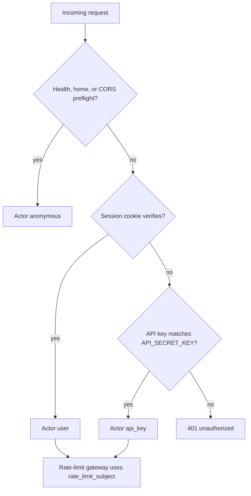
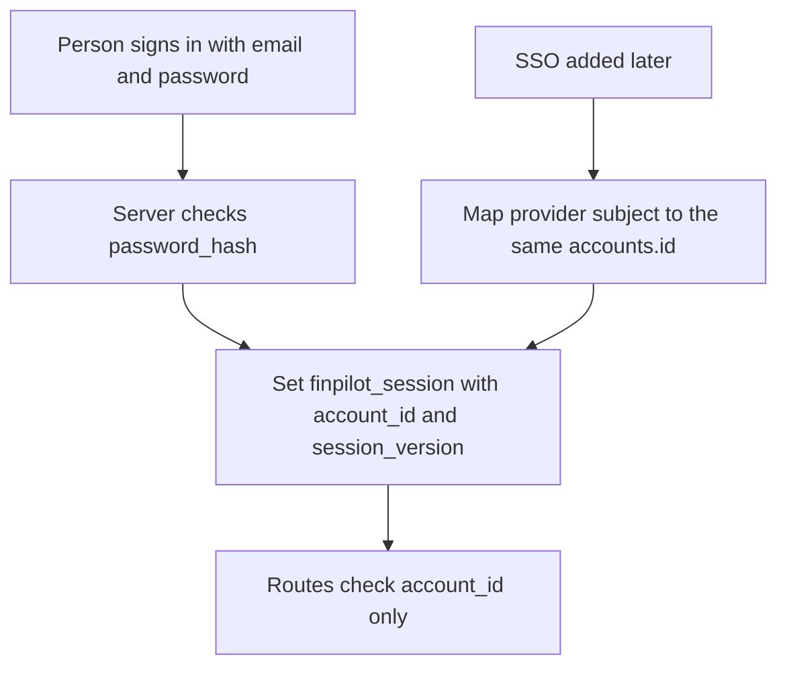
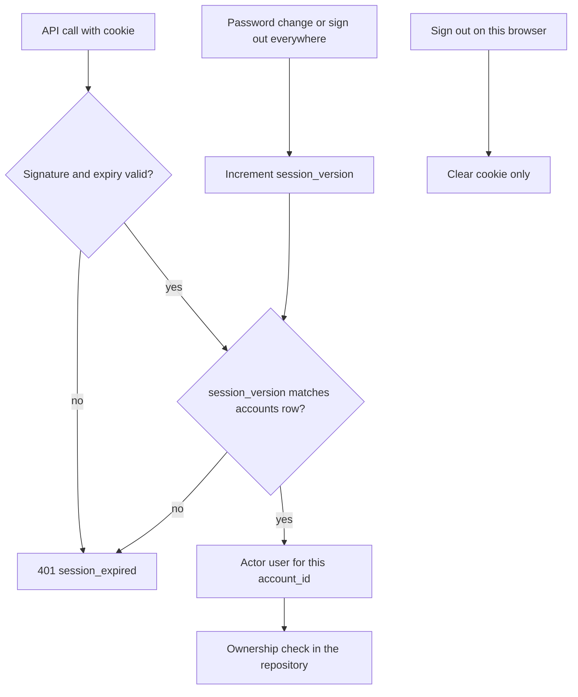
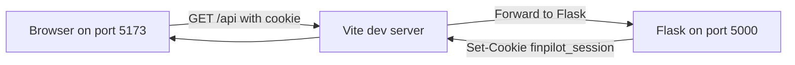
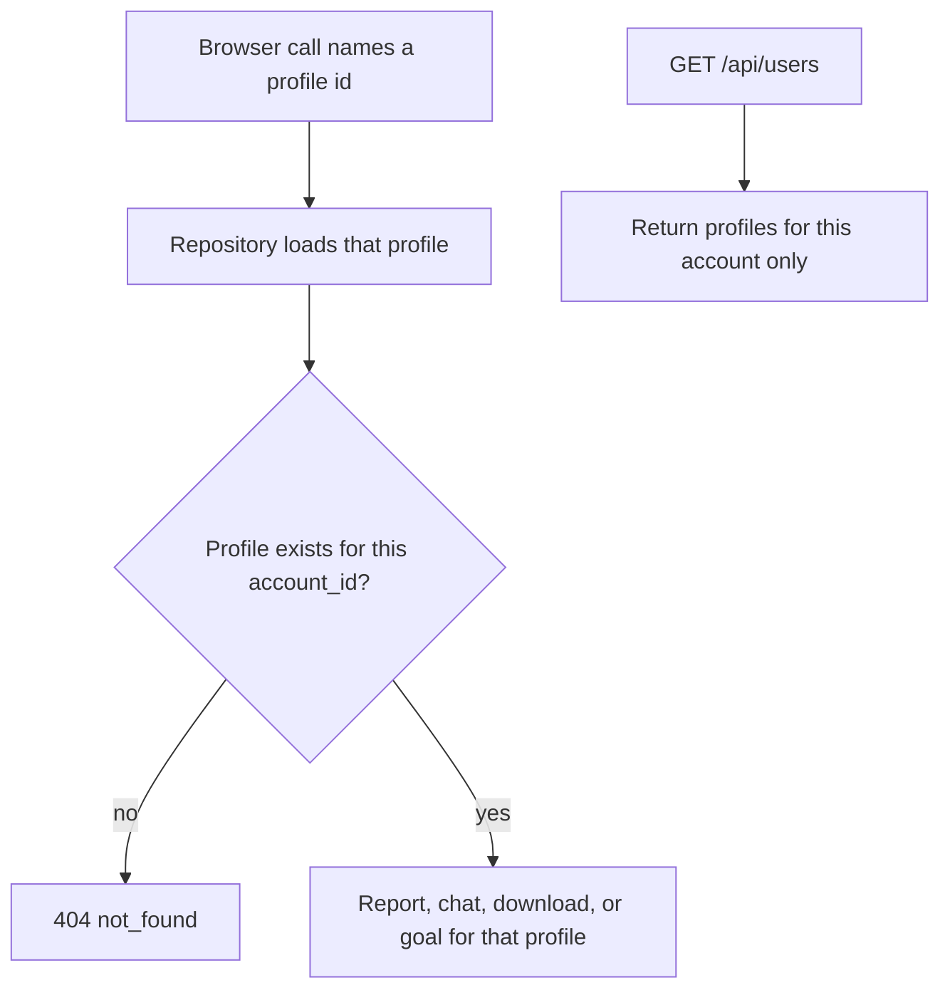
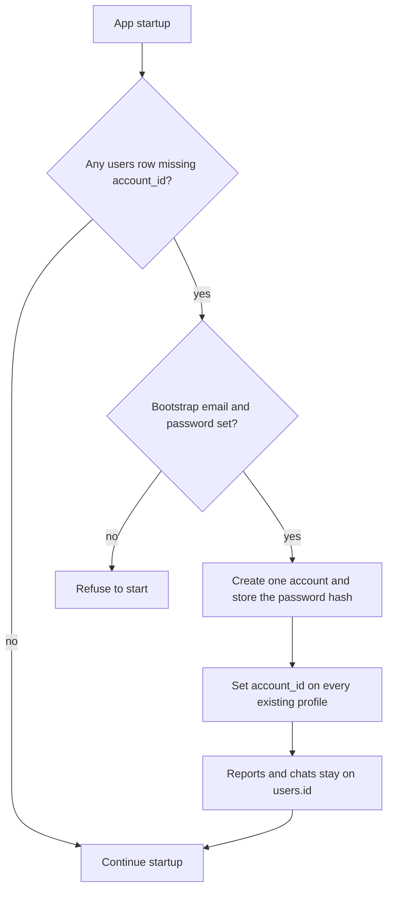

# Auth architecture

**Status:** Design only. Q5 has not started. Current behavior is still `docs/IDENTITY_SEAM.md`.  
**Date:** 2026-09-25  
**Scale target:** about 100 concurrent users.  
**Companions:** `docs/USER_EXPERIENCE.md`, `docs/IDENTITY_SEAM.md`, `docs/PLATFORM_QUALITY_WAVES.md`

This document is the technical contract for per-person login. It does not add a second identity beside `Actor`.

---

## 1. Decisions already made

| Decision | Choice |
|---|---|
| How a person proves who they are | Email and password. The password hash lives in this app. |
| External login (SSO) | Not in Q5. The account row must be able to gain a provider later without a second user table. |
| Existing profiles, reports, and chats | Attach all of them to one bootstrap account. |
| Browser credential in production | An HttpOnly session cookie. The production frontend does not contain `VITE_API_KEY`. |
| `API_SECRET_KEY` | Stays on the server. Local scripts and Swagger send it as `X-API-Key`. |

---

## 2. Two credentials, one actor

| Caller | What they send | `Actor.kind` | `rate_limit_subject()` |
|---|---|---|---|
| Signed-in browser | Session cookie | `user` | `acct:<account_id>` |
| Local script or Swagger | `X-API-Key` or Basic password equal to `API_SECRET_KEY` | `api_key` | Hash of the deployment key, as today |
| Health, `/`, CORS preflight | Nothing | `anonymous` | No bucket |

`resolve_actor()` in `services/actor.py` remains the only place that turns a request into an actor. Login does not add a second `before_request` that reads a user header beside the key check.

Resolution order:

1. CORS preflight, `/`, and `/api/health` stay `anonymous`.
2. If the session cookie verifies, the actor is `user`.
3. Else if `X-API-Key` or the Swagger Basic password matches `API_SECRET_KEY`, the actor is `api_key`.
4. Else the request is 401.



A browser session wins over a bundled API key. Once Q5 ships, the React app stops sending `X-API-Key`. Local scripts keep sending the key and never send the cookie.

`api_key` is a deployment tool, not a person. It may still read every profile until a later decision removes that. Browser `user` actors may read and change only rows whose `account_id` is theirs. Q5 ownership tests must fail closed for the browser. They must not pretend the deployment key became row-level security.

---

## 3. Account data

Financial profiles stay in `users`. An account is a separate row.

```text
accounts
  id                  integer primary key
  email               text unique, stored lowercase
  password_hash       text, nullable
  auth_provider       text, default 'local'
  session_version     integer, default 1
  created_at          text

users.account_id      integer, references accounts(id)
```

`password_hash` is nullable so a future SSO-only account can exist with no local password. `auth_provider` is `local` for every account Q5 creates. A later provider adds rows in a link table rather than a second accounts table:

```text
account_identities   (not created in Q5)
  account_id
  provider            for example 'oidc'
  subject             the stable id from that provider
```

The session cookie always carries the internal `accounts.id`. SSO, when it is required, signs the same cookie after it maps the provider subject onto that id. Routes keep checking `account_id`. They do not learn about the provider.



Password hashing uses Werkzeug (`generate_password_hash` / `check_password_hash`), which already ships with Flask. No new password package. The hash method is Werkzeug’s default (scrypt where the runtime has it, otherwise pbkdf2).

Email is the login name. It is unique. It is not the financial profile.

---

## 4. Session cookie

The cookie is signed with the existing Flask dependency `itsdangerous` (via Flask’s `URLSafeTimedSerializer` or an equivalent signed token). The payload is:

| Field | Role |
|---|---|
| `account_id` | Who is signed in |
| `session_version` | Must match `accounts.session_version` |
| expiry | Built into the signed token |

Cookie attributes:

| Attribute | Value |
|---|---|
| Name | `finpilot_session` |
| HttpOnly | yes |
| Secure | yes when the API is served over HTTPS; off for local HTTP |
| SameSite | `Lax` |
| Path | `/` |
| Max age | 12 hours |

Why this shape at 100 users:

- Login and logout are rare writes. Ordinary API calls do not insert a session row.
- SQLite remains one writer. A session table read or write on every request would sit on that same writer beside chat and report saves.
- The cookie is verified in memory. The account row is read only when `session_version` must be checked. That read is a primary-key lookup and stays on the WAL reader path.
- Password change and “sign out everywhere” increment `session_version`. Older cookies fail closed on the next request.
- Signing out of this browser clears the cookie. It does not have to write the database.

Do not store the session in process memory. A later multi-worker run (Waitress or Gunicorn) would drop logins on every other worker.



---

## 5. Local browser and the cookie

Today the SPA on port 5173 calls `http://127.0.0.1:5000` and sends `X-API-Key`. Those are two sites. A `SameSite=Lax` cookie set by port 5000 is not sent on that cross-site `fetch`.

Q5 local development uses the Vite dev server as a proxy so the browser calls its own origin (`/api` on port 5173) and Vite forwards to Flask. The cookie is then first-party and `SameSite=Lax` works on local HTTP. `credentials: 'include'` is set on those fetches. `VITE_API_KEY` is omitted from the browser client.

CORS stays an allow-list. Credentialed browser calls require a specific origin, never `*`. Local origins remain `http://localhost:5173` and `http://127.0.0.1:5173`. A future hosted frontend adds its origin to `CORS_ORIGINS` when the API is actually reachable from that host.



---

## 6. Ownership

`users.account_id` is the owner. Reports and chats stay tied to `users.id` and follow the profile through the existing foreign keys.

Every browser call that takes a profile id checks that the profile’s `account_id` equals the actor’s account. That covers profile read and delete, report, download, chat, and goal. A mismatch is 404 with `code: not_found`, so one account cannot learn that another account’s id exists.

`GET /api/users` returns only that account’s profiles.

The repository in `database/repository.py` is where the filter lives. Routes do not grow their own SQL.



---

## 7. Bootstrap migration

On startup, if `users` has rows with no `account_id`:

1. Create one account. Email comes from `BOOTSTRAP_ACCOUNT_EMAIL`. The password comes from `BOOTSTRAP_ACCOUNT_PASSWORD` and is stored only as a hash.
2. Set `account_id` on every existing `users` row to that account.
3. Leave reports and chats where they are. They already point at `users.id`.



If both env values are missing and a migration is required, the app refuses to start. It does not invent a password.

Rollback, before any new account has created its own profiles:

1. `UPDATE users SET account_id = NULL` for rows that point at the bootstrap account.
2. Delete the bootstrap account row.
3. Leave reports and chats unchanged.

Write that rollback next to the migration in Q5. Do not run it automatically.

New signups after Q5 create their own account and only see profiles they create. They do not see the bootstrap profiles.

---

## 8. What Q5 will not do

- No OAuth, OIDC, or hosted login service.
- No second middleware beside `resolve_actor()`.
- No `VITE_API_KEY` in a production frontend build.
- No move of the app database to PostgreSQL. That remains a Q6 decision.
- No claim that the deployment API key is per-person security.
