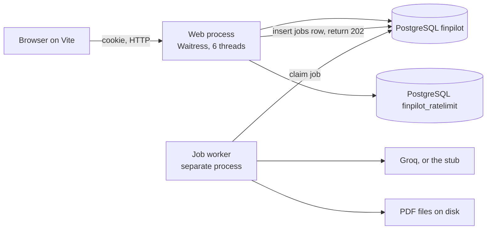

# Architecture and the Issue 6 capacity result

**Date:** 2026-09-27  
**Status:** Analysis only. This document does not change the system.  
**Measurement:** `docs/execution/testing_reports/REMEDIATION_6_LOAD_TEST_REPORT.md`  
**As-built description:** `docs/architecture/ARCHITECTURE.md`

---

## 1. Problem statement

FinPilot was described, at different times, as ready for about 100 people at once. That sentence covered two different ideas, and they were treated as one.

The first idea is that 100 people can open the app and see their profiles at the same moment. The second idea is that a report or a chat, which calls Groq, no longer makes those people wait.

Issue 6 was the measurement that was required before either idea could be said out loud. The pass lines were written before the run. The host was Waitress with 6 threads, a separate job worker, and PostgreSQL. Groq was stubbed so the test would not send a bill. Five real Groq jobs were left unrun because that cost had not been accepted.

The result is that the host answered. It did not meet the latency lines for health, for profile lists, for lists while reports were running, or for lists while chats were in flight. Report enqueue met its line, and the 15 rejections on that row are the account quota, which is 5 reports per minute. The fair conclusion is the one already recorded in the test report: it is not fair to say that about 100 people can load the app and list their profiles at once, or that a report no longer freezes those reads.

This document explains why those numbers came out that way, from the shape of the running system.

---

## 2. What “100 users” was actually asking

A person using FinPilot does not spend their time inside Groq. They sign in, list profiles, open a dashboard, and only sometimes ask for a report or a chat reply. Those two kinds of work have different costs and different places to run.

| Work                                                     | Where it runs after the remediation                                       | What “slow” feels like                |
| -------------------------------------------------------- | ------------------------------------------------------------------------- | ------------------------------------- |
| Health, profile list, stored report, chat history, goals | The web process                                                           | The page sits on a spinner            |
| Report text and chat reply                               | A separate worker process, after the web process has already returned 202 | The page polls until the job finishes |

The web process is the scarce resource for the first row. It has 6 Waitress threads. Every health check, every profile list, every enqueue, and every poll occupies one of those threads until the response is written. A thread that is busy cannot start the next request. The requests that are waiting are not failing. Their clock is still running, and that wait is part of the latency the load script records.

The worker is the scarce resource for Groq. It claims one job at a time per claim thread, calls the model, and writes the result. While it does that, the web process is supposed to keep serving lists. Issue 6 checked that split on purpose.

A third limit sits in front of both: quotas. One signed-in account may enqueue 5 reports per minute, and each profile may enqueue 10 reports per hour. Chat is 15 per minute and 60 per hour for that account. Those caps are product policy. A 429 from a quota is a successful enforcement, not a crashed server.

The pass lines kept these apart.

| Run                                                 | What it was allowed to prove                                        | Line                                                                                       |
| --------------------------------------------------- | ------------------------------------------------------------------- | ------------------------------------------------------------------------------------------ |
| 100 concurrent health checks                        | The web process can admit a crowd before any profile work           | p95 under 200 ms, no 5xx                                                                   |
| 100 concurrent profile lists, one signed-in account | That crowd can see profiles                                         | p95 under 300 ms, no 5xx, no 401                                                           |
| 20 concurrent report enqueues                       | Asking for a report returns quickly, or the quota explains the rest | p95 under 300 ms, HTTP 202, fewer than 20 jobs if the quota says so                        |
| 80 lists while 10 report jobs are running           | The web process is not the thing waiting on the model               | read p95 under 300 ms, jobs still running afterward                                        |
| 20 chats plus 80 lists                              | Chat does not shove the lists over that line                        | read p95 under 300 ms. A failure here required chat to leave the web request, then a rerun |
| 5 live Groq jobs                                    | The worker can finish real calls                                    | No latency target. Not run                                                                 |

Out of scope, and still out of scope: 100 people each generating a live Groq report at the same moment. That is a provider quota and a bill. It is not evidence about the web tier.

---

## 3. Architecture the measurement was aimed at

The picture below is the system Issue 6 measured, which is also the system that is running now. Later issues cleaned SQL, rewrote docs, deleted unused files, and put screens on URLs. None of those changed the thread count, the pool size, or the quotas.

Three processes matter.

The browser talks only to the Vite origin in local development. Vite forwards `/api` to the web process. The session cookie is first-party because of that proxy. The load script did not go through Vite. It talked to Waitress directly, on port 5001, with the same session cookie a browser would send.

The web process is Waitress, 6 threads, channel timeout 120 seconds. It builds the Flask app once. Each thread runs one request to completion: identify the caller, apply the rate-limit gateway, then run the route. Flask’s own debug server on port 5000 was already running during the test and was left alone. It was not the host, so its single-threaded reload loop is not what the numbers describe.

The job worker is `python -m services.jobs.worker`, a second process. It claims the oldest queued report or chat with a row lock that skips rows another claim already holds. It then calls Groq, or the stub. Report text is saved before the PDF file is written. A PDF failure still marks the job succeeded. A model failure marks it failed and, for chat, does not store the turn. A job left `running` longer than 120 seconds is failed as lost the next time a worker looks.

PostgreSQL is two databases on one server. `finpilot` holds accounts, profiles, reports, chat, jobs, and hashed API credentials. `finpilot_ratelimit` holds only quota counters. PDF bytes are files under `data/pdfs`. The report row stores the file name.

There is no Redis. The session is a signed cookie checked in memory, plus one read of the account row to compare `session_version`. Logout increments that version, so the old cookie stops working.

### 3.1 What a web request does before any business work

Every `/api` request except health, login, signup, logout, and CORS preflight goes through the same gate.

1. The session cookie is verified with `SESSION_SECRET`. A bad cookie is rejected and is not allowed to fall through to an API key.
2. If there is no cookie, a scoped key is matched by hash against `api_credentials`. The docs password opens Swagger only. It is not a data caller.
3. The rate-limit gateway records the hit in `finpilot_ratelimit` under that account. Health skips this step. An unknown `/api` path is rejected rather than left unlimited.
4. The route then uses one connection from the application pool for its own query.

A profile list therefore touches both databases: the limiter store for the quota, and `finpilot` for the account check and the `users` query. The list is limited to the signed-in account. The Issue 6 client was that one bootstrap account, so every list was the same owner and the same quota bucket.

Health is lighter and still not free. It does not check a session and it does not consume a quota. It does ping the limiter database and run `SELECT 1` on the application database, with a two-second statement timeout that applies only to that probe. Both pings borrow a pooled connection. The application pool also checks the connection when it is taken out, so a health call is several short round trips, not one.

The application pool is 10 connections, with room for 10 more if those 10 are busy. Six web threads cannot exhaust a pool of 10 by themselves. The pool becomes the bottleneck only when extra processes open their own pools. That happened once during Issue 6, and that run was discarded. Section 6 explains it.

### 3.2 What the worker does, and what it deliberately does not do

`POST /api/generate-report` inserts a `jobs` row and returns 202 with the job id. A second click for the same profile, while that job is queued or running, returns the same job. The unique rule is one active report per profile. Chat has no such unique rule. Many chats may be queued. `POST /api/chat` also returns 202.

The web thread is free as soon as the insert commits. Groq runs in the worker. The browser learns the outcome by polling. A report poll reads `GET /api/report/<id>`. A chat poll reads history. A finished job is omitted from that payload, because the stored report or the stored messages are the result. A queued, running, or failed job is included.

For the mixed read test, the stub was told to hold each claimed job for 12 seconds after the status was already `running`, and before the stub text was returned. The hold lived in the worker process. Its purpose was to keep 10 jobs visibly running for the whole read burst, so a pass could not be explained by “the jobs had already finished.”

### 3.3 Quotas that bound the test, and were not raised

| Route                     | Limit used in the run                                 | Who shares it                   |
| ------------------------- | ----------------------------------------------------- | ------------------------------- |
| Profile list, development | 600 per minute                                        | The one signed-in account       |
| Profile list, production  | 300 per minute                                        | The same kind of account bucket |
| Report enqueue            | 5 per minute per account, and 10 per hour per profile | Account, plus that profile      |
| Chat enqueue              | 15 per minute, and 60 per hour                        | The account                     |

The host was in development, so the list cap was 600 per minute. One hundred lists in one burst are inside that cap. Every list and every health response came back 200. Production’s 300 per minute would also have allowed a single burst of 100. The latency misses are not hidden 429s.

Report and chat caps are tighter, and they are per account. Twenty profiles owned by one account still share one 5-per-minute report budget. The hourly per-profile cap did not decide that row. The minute cap did.

---

## 4. Why six threads make a short query look slow

The load script starts every request of a row at once. It then records how long each one took to come back. With 6 threads, only 6 of those requests are being worked on. The other 94 are waiting for a thread. The recorded time is the wait plus the work.

The requests finish in waves of 6. The first wave finishes after one unit of work. The second wave finishes after two units, because it could not start until a thread freed. For 100 requests the last wave is the 17th. The 95th percentile sits near the 16th wave: request number 95 is in that wave when the work is spread evenly.

That arithmetic is the whole health result. A p95 of 367.78 ms at the 16th wave means each health call cost on the order of 23 ms of actual work, and the rest of the 368 ms is waiting for a thread. The same reading of the profile-list p95, 421.33 ms, is about 26 ms of work per list. Those are normal times for a few local PostgreSQL round trips plus Python. They are not evidence that a query scanned the table or that the database was down. Every response was 200. None was a 5xx.

The pass line of 200 ms for 100 health checks would have required each check to finish in roughly 12 ms or less, at this thread count, or it would have required more than 6 threads so that fewer waves were needed. The line of 300 ms for 100 lists would have required roughly 19 ms of work or fewer waves. The measured work is a little slower than that. The miss is small in milliseconds and decisive against the written line.

Eighty lists are 14 waves, not 17. Their p95 landing at 334.79 ms is the same kind of arithmetic, about 26 ms of work again. That row is compared with the idle list row in the next section, because the similarity is the evidence that the running jobs were not the cause.

Waitress’s default connection limit was left at 100. The failures were not “the server refused the connection.” They were “the server accepted it and the request waited.”

---

## 5. Each Issue 6 row, and why it landed where it did

The host for every row was the same: Waitress, 6 threads, channel timeout 120 seconds, `GROQ_STUB` on, limiter stored in PostgreSQL, health already showing the application database up. The client logged in as the bootstrap account and sent the cookie.

### 5.1 One hundred health checks — fail

p95 367.78 ms. One hundred responses, all 200, no 5xx. The line was 200 ms.

Health does the least business work of any row, and it still missed. It skips the session and the quota. It still pings both databases. One hundred of those pings arrived together, and only 6 could run at a time. Section 4 is this row. A health check that is individually cheap becomes a third of a second for the people at the back of a crowd of 100.

This row is the cleanest evidence in the set. Nothing about Groq, reports, or chat is involved. The web tier, alone, does not meet a 100-wide health burst on 6 threads.

### 5.2 One hundred profile lists — fail

p95 421.33 ms. One hundred responses, all 200, no 5xx, no 401. The line was 300 ms.

A list does more than health. The cookie is checked, the account row is read, the limiter store records the hit, and `users` is queried for that account. That extra work is why 421 ms sits above the health figure of 368 ms, by about the cost of those added round trips once they have been multiplied by the same 16 waves.

The requests were authorized. The quota did not fire. The database returned the rows. The people at the back of the queue waited past 300 ms because they were number 90-something in a line served by 6 threads.

This is the row that forbids the sentence “about 100 people can load the app and list their profiles at once.”

### 5.3 Twenty report enqueues — pass

p95 114.82 ms. Five responses were 202. Fifteen were 429. The line was p95 under 300 ms, with fewer than 20 accepted jobs allowed when the quota says so.

Twenty profiles were created so the “one active report per profile” rule would not be the thing that rejected the extras. The account still shares one budget of 5 reports per minute. The first 5 inserts were accepted and returned immediately. The other 15 were rejected by the gateway before a job row was the interesting part. A rejection is a short response, which is why the percentile for the whole burst is 115 ms, faster than the list bursts. Less work, and many of the calls ended at the quota.

The pass is real, and it is a narrow pass. It shows that asking for a report no longer waits for Groq inside the web request. It does not show that 20 reports were started. Five were started. That is the policy.

### 5.4 Eighty lists while ten reports were running — fail

p95 334.79 ms. Eighty responses, all 200. After the burst, 10 jobs were still `running`. The line was 300 ms.

The jobs were held for 12 seconds inside the worker, in one process, on 10 claim threads that shared that process’s single pool. The web process was a different process. It did not call Groq. It listed profiles while those jobs stayed running, which is what the “still running afterward” check confirms.

Compare this p95 with the idle list of 100. Eighty lists at 335 ms and one hundred lists at 421 ms are the same service time of about 26 ms, counted across fewer waves because there were 80 requests instead of 100. The running reports did not add a visible penalty on top of the thread queue. They also did not remove it. The row fails the written line by about 35 ms.

So the architecture did the thing it was built to do: the model wait moved out of the web process. The line still fails because 80 simultaneous lists on 6 threads already land near 300 ms, and this sample landed just over it. “The report no longer freezes those reads” would require the mixed line to pass. It did not. The freeze that remains is the thread queue, which exists whether or not a report is running.

### 5.5 Chat plus lists, before chat was queued — fail, and the gate did its job

Read p95 526.63 ms, 80 lists all 200. Of 20 chats, 15 returned 200 and 5 returned 429. The 200 bodies contained the stubbed advisory text, which means Groq’s stand-in ran inside the web request. The line was 300 ms.

This is the old shape. A chat occupied a Waitress thread for the whole stub call, and the lists needed those same threads. Fifteen chats were allowed by the 15-per-minute cap, so up to 15 threads’ worth of chat work was in the pile with 80 lists. Only 6 threads existed. The lists waited behind chat work as well as behind each other. That is why 527 ms is worse than the idle list at 421 ms, even though the model was a stub and not a live network call.

The plan’s rule was to stop, move chat onto the worker, and rerun. That rule was followed. No mixed-workload claim was published from this row.

### 5.6 Chat plus lists, after chat was queued — still a fail

Read p95 356.86 ms, 80 lists all 200. Of 20 chats, 15 returned 202 and 5 returned 429. Fifteen chat jobs were accepted. The line was still 300 ms.

The important change is the status code and the time. The chats no longer returned the advisory text. They returned a job id. The drop from 527 ms to 357 ms is the stub leaving the web thread. What remains is almost the same crowd as the other read rows: on the order of 100 requests, 6 threads, a few database round trips each. Three hundred and fifty-seven milliseconds is that crowd. It is not a Groq hold.

The rerun was not given a further tuning pass. The plan said not to publish a mixed-workload claim on a failed row. The row is still failed after the queue.

### 5.7 Five live Groq jobs — not run

There is no latency number, no success count, and no error code from live Groq in Issue 6. The stub answers the question “does the web process wait?”, because the hold was placed where the model call sits. The stub does not answer “does a real Groq call finish, and how long does the worker spend?” That sample stays blocked until someone accepts the cost.

---

## 6. The 1168 ms figure, and why it is not the result

An earlier attempt at the “lists while reports are running” row started 10 separate operating-system processes as workers. The read p95 was 1168.82 ms. That number is recorded so it is not mistaken for the outcome, and it is not the outcome.

Each process creates its own application pool of 10 connections, with room for 10 more. Ten processes can open on the order of 200 connections before the web process opens any. PostgreSQL on the local Docker server is one server, with one connection ceiling. A burst of new pools spends its time opening and waiting for connections. The lists then look slow for a reason that the product does not use: production is one web process and one worker process, not ten worker processes.

The valid run kept the 10 claim threads inside one worker process, so they shared one pool. That is the 334.79 ms result in section 5.4.

---

## 7. What the queue solved, and what it left in place

The queue is the remedy for a specific failure: a model call sitting on a web thread, so that everyone else’s list waits for Groq. Issue 6 showed that failure in the first chat gate, moved chat onto the same worker as reports, and showed the lists get faster once the stub was no longer in the web process.

The queue is not a remedy for too few web threads. After the move, health, lists, lists-during-jobs, and lists-during-chat all still miss their lines, and they miss by the same mechanism. The work inside each request is short. The line of people waiting for one of 6 threads is long. Returning 202 quickly does not give Waitress a seventh thread.

Several things that often get blamed are not what these numbers show.

The database was up. Health said so before the run, and no row produced a 5xx. The SQL text was still the older placeholder style during this test. Issue 7 later switched it to named parameters and checked the query plans. The plans on the small live tables were the same kind of scan a tiny table gets with or without an index, and the report lookup used the existing index. Issue 6 was not rerun, because that change did not introduce a new sequential scan. The capacity sentence is still the Issue 6 sentence.

The rate limiter did not create the latency misses. The list and health bodies were all 200. The 429s that did appear are the report cap of 5 per minute and the chat cap of 15 per minute. Those were predicted by the pass-line note that a quota must be explained rather than treated as a dropped request.

The PDF column and the SQLite import flag were not on this path. Lists do not read PDF bytes. Health does not open a SQLite file.

A larger web thread count would change the wave arithmetic. That change was outside Issue 6, which fixed the host at 6 threads so the number would describe a known configuration. Raising it after a failure, in order to pass, would have measured a different host. The document that records the run does not do that, and this analysis does not recommend a number to switch to. It only identifies the knob the failed rows are actually turning.

---

## 8. The sentence that is fair

This host does not meet the written pass lines for 100 concurrent health checks or 100 concurrent profile lists. Report enqueue does. Eighty lists while 10 report jobs were running, and the chat gate after chat was queued, are both still over 300 ms. It is not fair to say that about 100 people can load the app and list their profiles at once, or that a report no longer freezes those reads.

Anything shorter tends to slide back into the claim Issue 6 was invented to test. “The queue works” is true about Groq leaving the web thread, and it is the 527 ms to 357 ms drop. It is not a pass of the 300 ms line. “Reads returned 200” is true, and it means the system failed open in the sense of answering, not in the sense of answering inside the budget.

---

## 9. What this measurement does not know

Live Groq latency for a report job is unknown. The worker’s hold was a fixed 12 seconds used only to keep jobs in `running`. A real call can be shorter or longer, and a longer call still should not occupy a Waitress thread. That remains an argument from the design, not from five finished live jobs.

The test used one account and a burst that started together. Real visitors arrive spread out, on many accounts, with their own quota buckets. A spread-out arrival can look fine on 6 threads while a bell ringing at the same second does not. Issue 6 measured the bell. It did not measure a gentle hour of traffic, and a gentle hour would not satisfy the written lines either. The lines were about the burst.

The browser, Vite, and the debug server on port 5000 were not the client or the host. Restarting the debug server so that a person clicking around gets the queued chat path does not change the Waitress numbers.

Issue 7’s query-plan check was not a second load test. Issues 8 through 11 rewrote docs, removed unused modules, put the signed-in screens on URLs, and added a small frontend test command. They did not rerun Waitress.

---

## 10. How the rest of the architecture sits around this limit

The pieces that are in good shape are the ones the latency miss does not touch.

Sign-in is an HttpOnly cookie signed with its own secret, separate from the Swagger password. A scoped key is a hash tied to one account and to the scopes `data` and `llm`. Ownership is the account id on the profile. A mismatch is hidden as not found. Logout bumps the session version.

Reports and chats are durable rows in `jobs`. The screen can refresh and poll. A lost worker becomes a failed job instead of a request that hangs until the channel timeout. Text is stored before the PDF file, so a PDF problem does not throw away the advisory.

PostgreSQL replaced a single-writer SQLite file. That removed one historic bottleneck, the writer lock around chat inserts and PDF blobs. Issue 6 shows the next bottleneck that was waiting behind it: the 6 web threads, once the database was no longer the thing everyone queued on.

The frontend now keeps Dashboard, Advisory, Chat, Goals, and Profile on paths, and the profile id in session storage. That changes refresh and the back button. It does not change how many lists Waitress can serve at once. Polling every second or two, from many open browsers, would add more requests to those same 6 threads. The Issue 6 client did not include that poll traffic. A room of open dashboards would.

---

## 11. Closing

Issue 6 asked whether this host, as configured, can carry the two claims people were ready to make. It can accept a report or a chat onto a queue and return in well under 300 ms, inside the quotas. It cannot put 100 simultaneous health checks under 200 ms, or 100 simultaneous profile lists under 300 ms, on 6 Waitress threads. Moving the model call into another process removed the worst mixed-workload penalty and left the thread queue in place. The lists while jobs were running are the proof that the jobs were not the remaining delay, because the per-request time matches the idle list. The earlier 1168 ms sample was a connection storm from ten pools and is not the result. Live Groq remains unmeasured until its cost is accepted.