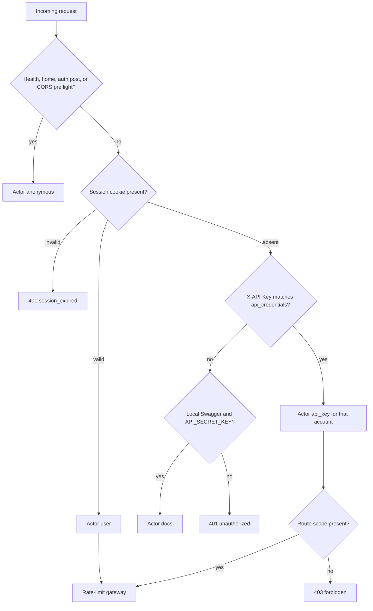
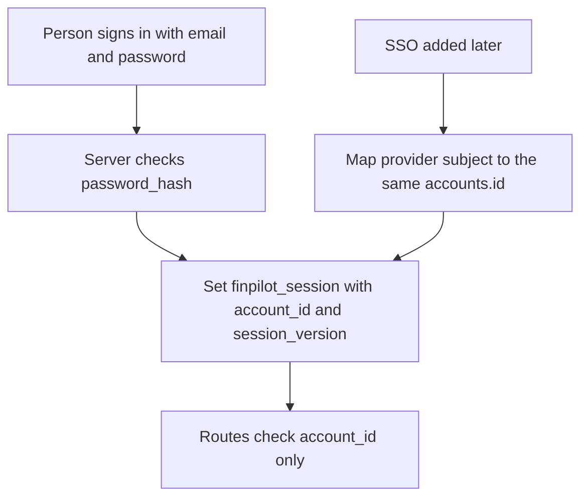
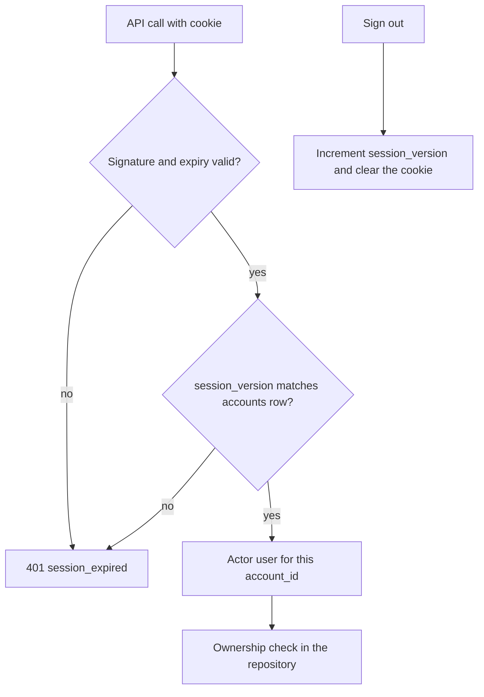
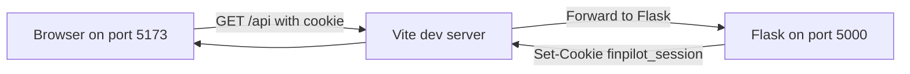
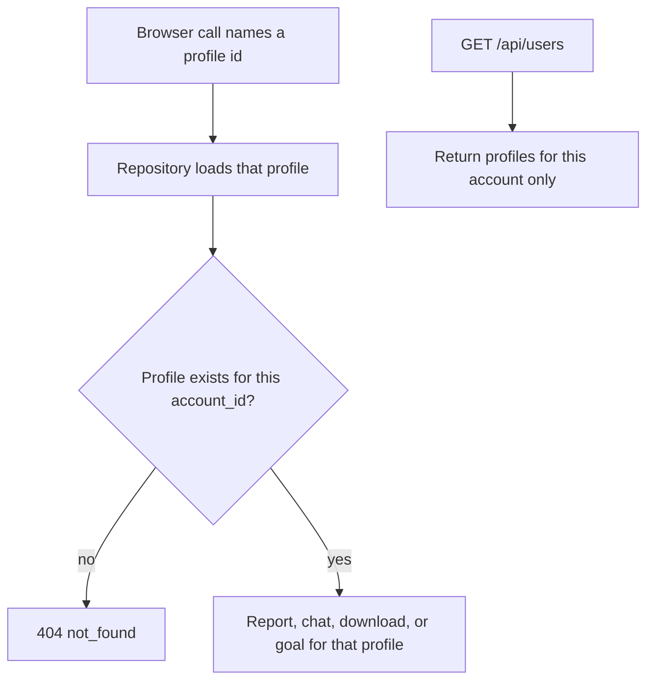
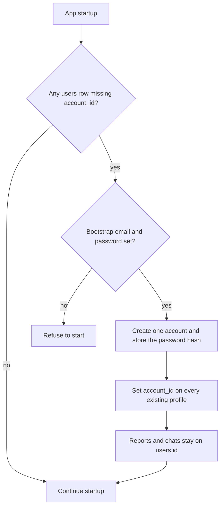

# Auth architecture

**Status:** Shipped. This file matches the code after Q5, issue 3 (separate session secret), and issue 5 (scoped credentials).  
**Revised:** 2026-09-27. Issue 5 replaced the deployment key on data routes. `API_SECRET_KEY` opens local Swagger only. A data caller sends the session cookie or a hashed key from `api_credentials`.  
**Companions:** `docs/architecture/ARCHITECTURE.md` (as-built), `docs/architecture/USER_EXPERIENCE.md`

This document is the technical contract for per-person login. It does not add a second identity beside `Actor`.

---

## 1. Decisions already made

| Decision | Choice |
|---|---|
| How a person proves who they are | Email and password. The password hash lives in this app. |
| External login (SSO) | Not in Q5. The account row must be able to gain a provider later without a second user table. |
| Existing profiles, reports, and chats | Attach all of them to one bootstrap account. |
| Browser credential in production | An HttpOnly session cookie. The production frontend does not contain `VITE_API_KEY`. |
| `API_SECRET_KEY` | Stays on the server. It is the local Swagger password. Data scripts use a scoped key. |

---

## 2. Credentials, one actor

| Caller | What they send | `Actor.kind` | `rate_limit_subject()` |
|---|---|---|---|
| Signed-in browser | `finpilot_session` | `user` | `acct:<account_id>` |
| Script with a scoped key | `X-API-Key` matched to `api_credentials` | `api_key` | `acct:<account_id>` |
| Local Swagger | Basic password equal to `API_SECRET_KEY` | `docs` | Not a data actor |
| Health, `/`, login, signup, logout, CORS preflight | Nothing | `anonymous` | No bucket |

`resolve_actor()` in `services/actor.py` remains the only place that turns a request into an actor.

Resolution order:

1. CORS preflight, `/`, `/api/health`, and the login, signup, and logout posts stay `anonymous`.
2. If a session cookie is present and verifies against `SESSION_SECRET` and `accounts.session_version`, the actor is `user`. A bad cookie is `401` `session_expired` and does not fall through.
3. Else if `X-API-Key` matches a live `api_credentials` row, the actor is `api_key` for that account, with scopes `data`, `llm`, or both.
4. Else if the path is local Swagger and the key equals `API_SECRET_KEY`, the actor is `docs`.
5. Else the request is `401` `unauthorized`.

A scoped key on a data route needs scope `data`. `POST /api/generate-report` and `POST /api/chat` need scope `llm`. A missing scope is `403` `forbidden`. `GET /api/auth/me` still requires `kind=user`.



The React app sends the cookie (`credentials: 'include'`) and does not send `X-API-Key`. A scoped key is issued with `scripts/issue_api_credential.py`. The raw key is printed once. The row stores a hash.

`api_key` is that account, not a superuser. It sees the same profiles as the cookie for that account. There is no superuser scope.

---

## 3. Account data

Financial profiles stay in `users`. An account is a separate row.

```text
accounts
  id                  integer primary key
  email               text unique, stored lowercase
  password_hash       text, nullable
  auth_provider       text, default 'local'
  session_version     integer, default 1
  created_at          text

users.account_id      integer, references accounts(id)
```

`password_hash` is nullable so a future SSO-only account can exist with no local password. `auth_provider` is `local` for every account Q5 creates. A later provider adds rows in a link table rather than a second accounts table:

```text
account_identities   (not created in Q5)
  account_id
  provider            for example 'oidc'
  subject             the stable id from that provider
```

The session cookie always carries the internal `accounts.id`. SSO, when it is required, signs the same cookie after it maps the provider subject onto that id. Routes keep checking `account_id`. They do not learn about the provider.



Password hashing uses Werkzeug (`generate_password_hash` / `check_password_hash`), which already ships with Flask. No new password package. The hash method is Werkzeug’s default (scrypt where the runtime has it, otherwise pbkdf2).

Email is the login name. It is unique. It is not the financial profile.

---

## 4. Session cookie

The cookie is signed with `itsdangerous` `URLSafeTimedSerializer` in `services/sessions.py`, salt `finpilot-session`, secret `SESSION_SECRET`. The payload is:

| Field | Role |
|---|---|
| `account_id` | Who is signed in |
| `session_version` | Must match `accounts.session_version` |
| expiry | Built into the signed token |

Cookie attributes:

| Attribute | Value |
|---|---|
| Name | `finpilot_session` |
| HttpOnly | yes |
| Secure | yes when the API is served over HTTPS; off for local HTTP |
| SameSite | `Lax` |
| Path | `/` |
| Max age | 12 hours |

Why this shape:

- Ordinary API calls do not insert a session row. The cookie is verified in memory. The account row is read to check `session_version`.
- Logout increments `session_version` and clears the cookie, so that cookie cannot be reused. A later password change can call the same `bump_session_version`.

Do not store the session in process memory. Waitress or Gunicorn would drop those logins on every other worker.



---

## 5. Local browser and the cookie

The Vite dev server proxies `/api` to Flask. The browser calls its own origin (`http://localhost:5173`) and the cookie is first-party, so `SameSite=Lax` works on local HTTP. `credentials: 'include'` is set on those fetches. The browser client does not send `VITE_API_KEY`.

CORS stays an allow-list. Credentialed browser calls require a specific origin, never `*`. Local origins remain `http://localhost:5173` and `http://127.0.0.1:5173`. A future hosted frontend adds its origin to `CORS_ORIGINS` when the API is actually reachable from that host.



---

## 6. Ownership

`users.account_id` is the owner. Reports and chats stay tied to `users.id` and follow the profile through the existing foreign keys.

Every browser call that takes a profile id checks that the profile’s `account_id` equals the actor’s account. That covers profile read and delete, report, download, chat, and goal. A mismatch is 404 with `code: not_found`, so one account cannot learn that another account’s id exists.

`GET /api/users` returns only that account’s profiles.

The repository in `database/repository.py` is where the filter lives. Routes do not grow their own SQL.



---

## 7. Bootstrap migration

On startup, if `users` has rows with no `account_id`:

1. Create one account. Email comes from `BOOTSTRAP_ACCOUNT_EMAIL`. The password comes from `BOOTSTRAP_ACCOUNT_PASSWORD` and is stored only as a hash.
2. Set `account_id` on every existing `users` row to that account.
3. Leave reports and chats where they are. They already point at `users.id`.



If both env values are missing and a migration is required, the app refuses to start. It does not invent a password.

Rollback, before any new account has created its own profiles:

1. `UPDATE users SET account_id = NULL` for rows that point at the bootstrap account.
2. Delete the bootstrap account row.
3. Leave reports and chats unchanged.

Write that rollback next to the migration in Q5. Do not run it automatically.

New signups after Q5 create their own account and only see profiles they create. They do not see the bootstrap profiles.

---

## 8. What this auth does not do

- No OAuth, OIDC, or hosted login service.
- No second middleware beside `resolve_actor()`.
- No `VITE_API_KEY` in the production browser.
- No superuser scope. `API_SECRET_KEY` is not a data actor.
- Application data is PostgreSQL. That move is already done and is described in `docs/architecture/ARCHITECTURE.md`.
