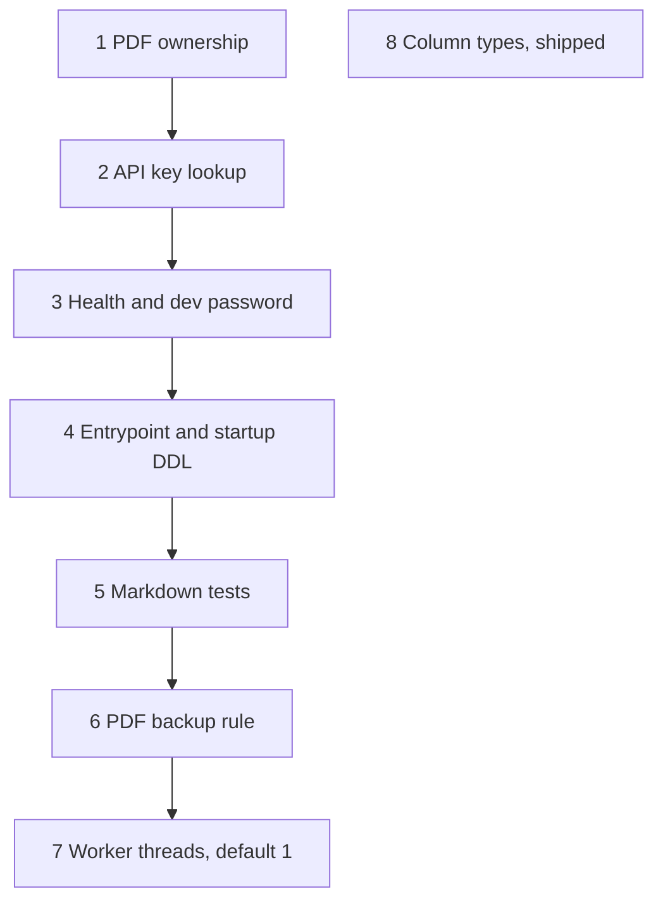

# Architecture review follow-up

**Status:** Issues 1–8 shipped on 2026-09-27. Issue 8 was the one-time column-type script, run after a copy of the live rows passed the same casts.
**Date:** 2026-09-27
**Review:** Source review of the application code the same day. Overall **6.0 / 10**. The docs folder was not an input to that review.
**Audience:** The next series of changes after that review.

This document lists every issue that review recorded, the fix for each one, and the order to ship those fixes. It is not an implementation record. When an issue is actually built, its test report goes in `docs/execution/testing_reports/`.

Scores from the review, so this file can be read alone:

| Area | Score |
| --- | --- |
| Code quality | 7.2 |
| Data model | 6.6 |
| Reliability | 6.4 |
| Frontend | 6.3 |
| Security | 5.6 |
| Operability | 5.4 |
| Scalability | 4.8 |

The 6.0 is the weighted result: security 22%, scalability 18%, code quality 16%, reliability 14%, data model 12%, frontend 10%, operability 8%.

---

## 1. What this plan will change, and what it will not

Eight issues. The first five change behavior or close a hole. The last three record a limit and either leave the operating point where it is or wait for an explicit go.

1. **Close the PDF download hole first.** It is the only high-severity finding. A signed-in account can read another account's file.
2. **Stop the unbounded API-key scan second.** It runs before the rate limiter, so a flood of bad keys is not counted.
3. **Do not raise Groq concurrency, pool size, or quotas to make a score move.** The worker may gain a way to run more than one claim inside one process. The default stays one claim at a time until a separate cost decision says otherwise.
4. **Do not add Alembic, Waitress, a sanitizer package, a router, or a component-test runner.** Those installs need an explicit yes. The fixes below stay inside the code and the test commands that already exist.
5. **Do not move PDFs to object storage in this sequence.** The review's design is for one machine. The fix is an operating rule: back up `data/pdfs` with the database. A second server is a later decision.

Signup stays open and rate limited. There is no email verification in this plan. The review described that as the current identity model, not as a defect to close.

---

## 2. Issues

### Issue 1 — PDF download ignores ownership

**Severity:** High. Security.
**Where:** `routes/report_routes.py` `download_report`. The bytes come from `database/repository.py` `load_pdf_bytes`, which selects `pdf_path` by `user_id` only.

**What the code does.** `GET /api/download-report/<id>` requires a session or a scoped key, then reads the PDF and returns it. `get_user_by_id` runs later, and only on the path that rebuilds a missing file. When the file already exists, the owner check never runs. Profile ids are sequential integers. List, generate, chat, goals, and `GET /api/report/<id>` call `get_user_by_id` first. This route does not.

The rebuild branch has the same order problem. It loads the stored report, then checks the profile. A mismatched profile does not receive the text today. The check still belongs before any read of that row.

**Solution.** Check ownership first on both branches. Call `get_user_by_id`. If it returns nothing, respond 404 with the same body used for a missing report, so a stranger cannot tell "not yours" from "no file." Only then call `load_pdf_bytes` or the rebuild. Keep the file-name rule in `database/pdf_files.py` `resolve`: a stored path still cannot leave the PDF directory.

Do not filter `load_pdf_bytes` through the request actor. The worker has no request. The route is the place that knows the caller. A repository change that silently no-ops outside a request would hide the bug again.

**Done when.** An account that owns profile A receives A's PDF. An account that does not own A receives 404 for A's id, whether or not the file exists. A scoped key without the `data` scope still receives 403 from the existing gate. Pytest covers the cross-account case. Report: `docs/execution/testing_reports/REVIEW_FOLLOWUP_1_PDF_OWNERSHIP_TEST_REPORT.md`.

### Issue 2 — API key check walks every hash before the limiter

**Severity:** Medium. Security.
**Where:** `database/repository.py` `find_active_api_credential`, called from `services/actor.py` `resolve_actor`, called from the first `before_request` in `app.py`. The rate-limit gateway is the second `before_request`.

**What the code does.** A presented `X-API-Key` loads every row in `api_credentials` where `revoked_at` is null and runs a password-hash check on each one. Account passwords should stay on that slow hash. API keys are random (`secrets.token_urlsafe(32)` in `issue_api_credential`), so they do not need a password hash to be stored safely. When the key matches nothing, the auth hook returns 401. Flask then skips the rate-limit hook. A caller can force that scan without ever being counted.

**Solution.** Two parts, shipped together.

Store a SHA-256 hex digest of the raw key in a new column, indexed unique among live rows. Lookup is one indexed read, then a compare of that digest. New keys write the digest in `issue_api_credential`. Existing rows have only a password hash, and the digest cannot be rebuilt from it. Those rows stay on the slow scan until they are reissued, and startup logs how many live rows still have no digest. Reissue is `scripts/issue_api_credential.py`. Revoked rows are ignored by the lookup, as they are today.

Count a rejected key before the 401 is returned. Use the existing SQL limiter, keyed by client address, on the credential-failure path inside the auth hook. A missing cookie with no key stays a normal `session_expired` and is not this bucket. Login and signup keep `RATELIMIT_AUTH`. Do not raise any LLM quota.

**Done when.** A new key still opens only its account and its scopes. A wrong key is 401, and enough wrong keys from one address become 429. A lookup of a new key does not load every credential row. Pytest covers a wrong key, a revoked key, and a scoped key that lacks `data`. Report: `docs/execution/testing_reports/REVIEW_FOLLOWUP_2_API_KEY_LOOKUP_TEST_REPORT.md`.

### Issue 3 — Public health and the dev database password

**Severity:** Low. Security. Two findings, one change, because both are what an unauthenticated caller can learn or reuse.

**Where:** `app.py` `health`. `config.py` default `APP_DATABASE_URL`. `docker-compose.yml` `POSTGRES_PASSWORD`.

**What the code does.** `GET /api/health` is open, which is correct for a probe. The body also returns Groq timeout, worker timeout, recommended worker count, and the rate-limit backend name. The local database password `finpilot_dev_password` is the default in source and in Compose. That is fine for a laptop. It is not fine if a production process starts without overriding it.

**Solution.** The public health body keeps `status`, `database_ok`, and `ratelimit_store_ok`, plus the HTTP status (200 or 503) that already follows from those flags. Timeouts, recommended workers, and the backend name leave the public body. The probe still pings both databases. It still does not log the exception text.

When `FLASK_ENV` is not `development`, `dev`, or `local`, refuse to start if `APP_DATABASE_URL` contains `finpilot_dev_password`. Leave the Compose default in place for local Docker. Do not print the real URL or the password in the error. Say only that the production URL is still the local default.

**Done when.** Health without a cookie is 200 or 503 and the body has the three fields above. A production-shaped `FLASK_ENV` with the dev password fails `Config.validate`. Local Compose still starts. Report: `docs/execution/testing_reports/REVIEW_FOLLOWUP_3_HEALTH_AND_DEV_PASSWORD_TEST_REPORT.md`.

### Issue 4 — The packaged entrypoint is the Flask debugger, and startup rewrites schema

**Severity:** Medium. Operability.
**Where:** `app.py` `app.run(debug=True)`. `database/models.py` `_allow_chat_jobs`, which drops and re-adds the `jobs` kind check on every start. Waitress is not in `requirements.txt`.

**What the code does.** `python app.py` starts the debug reloader. That process serves one request at a time. It is the right loop for local editing. It is the wrong process to leave up as the server. Separately, every start drops the kind check constraint and adds it again, even when the check already allows `report` and `chat`.

**Solution.** `app.run(debug=True)` runs only when `FLASK_ENV` is `development`, `dev`, or `local`. Any other value logs that this entrypoint is the local debugger and exits without listening. Do not add Waitress to `requirements.txt` in this issue. The host command stays an operator command (`python -m waitress ...`), already how a measured run is started. Adding the package waits for an explicit install yes.

`_allow_chat_jobs` reads the current check text. If it already restricts `kind` to `report` and `chat`, it does nothing. If the old report-only check is present, it replaces that check once. `ADD COLUMN IF NOT EXISTS` stays as it is.

**Done when.** A production-shaped environment does not open the debug server. A second startup against a database that already has the chat kind check does not drop that constraint. Pytest covers both. Report: `docs/execution/testing_reports/REVIEW_FOLLOWUP_4_ENTRYPOINT_AND_STARTUP_DDL_TEST_REPORT.md`.

### Issue 5 — Advisory HTML is a hand-built string, and the UI has no component tests

**Severity:** Low. Frontend.
**Where:** `frontend/src/lib/markdown.jsx`. `dangerouslySetInnerHTML` receives the string from `parseMarkdown`.

**What the code does.** Groq text is escaped for `&`, `<`, and `>` before tags are added. Links are reduced to their label. That is why a normal advisory does not execute script. The renderer is still a string of HTML, and nothing in `npm test` locks the escape. The signed-in screens have no component tests. Route decisions and the report poll already have `node --test` coverage. That split stays.

**Solution.** Export the escape-and-render function, or a pure helper it already uses, and add cases to the existing `npm test` command. A payload with `<script>`, an image with an event handler, and a `javascript:` link must come back as text, not as a live tag. Do not add a sanitizer package. Do not add a browser component runner. Do not rewrite the renderer.

**Done when.** `npm test` in `frontend/` passes, including those cases, and still does not need a running Vite server. Report: `docs/execution/testing_reports/REVIEW_FOLLOWUP_5_MARKDOWN_TEST_REPORT.md`.

### Issue 6 — PDF files sit outside the database

**Severity:** Limit of the current design, called out in the review's closing. Not a defect in the one-machine layout.
**Where:** `database/pdf_files.py`. `reports.pdf_path` stores the file name. Bytes live under `PDF_STORAGE_DIR` (default `data/pdfs`).

**What the code does.** The web process and the worker on this machine share the directory. Advisory text is in PostgreSQL. A second server does not see the files. A database restore does not bring them back.

**Solution.** No storage move. The operating rule, written in this file and in the as-built architecture doc when this issue is done, is: back up `data/pdfs` in the same breath as the `finpilot` database, and restore both. `resolve` continues to trust only the file name. Object storage is the step when a second host is actually wanted. It is not part of this sequence.

**Done when.** The architecture doc states that rule in the data section, and a restore note says the PDF directory is a separate backup. No pytest. Report: `docs/execution/testing_reports/REVIEW_FOLLOWUP_6_PDF_BACKUP_TEST_REPORT.md`, as a checklist of the sentences that were added, the same kind of check the docs issue used before.

### Issue 7 — One worker loop finishes one Groq job at a time

**Severity:** Medium. Scalability.
**Where:** `services/jobs/worker.py` `main`. `claim_next_report_job` already uses `FOR UPDATE SKIP LOCKED` and `LIMIT 1`.

**What the code does.** The process claims one job, calls Groq, then sleeps half a second when the queue is empty. The SQL can be claimed by more than one worker. The process that ships starts one loop. Ten separate worker processes are the wrong fix: each opens its own pool of 10 plus 10 overflow.

**Solution.** Allow more than one claim thread inside the one worker process, sharing that process's engine. The count is an environment setting, default **1**, so this issue does not increase the Groq bill and does not change today's throughput. Tests keep calling `process_once()` on one thread. Do not start extra operating-system processes. Do not change `pool_size` or `max_overflow`. Turning the default up waits for an explicit cost yes and is not this issue.

**Done when.** With the setting at 1, behavior matches the current loop, including the idle sleep. A test can run two `process_once` calls against two queued jobs without a second pool. The default in code and in `.env.example` is 1. Report: `docs/execution/testing_reports/REVIEW_FOLLOWUP_7_WORKER_THREADS_TEST_REPORT.md`.

### Issue 8 — JSON and timestamps are TEXT, and there is no migration tool

**Severity:** Low. Data.
**Where:** `database/models.py`. `reports.health_json` and `reports.ai_report` are `TEXT`. Several `created_at` columns are `TEXT`. `jobs` already uses `timestamptz`. Schema changes run from `create_tables` on startup.

**What the code does.** The application reads and writes those values as strings. That works at this size. There is no Alembic history. Startup DDL is the migration tool, which is why issue 4 stops it from rewriting a constraint that is already correct.

**Solution.** Do not add Alembic. Do not convert columns in this sequence. A type change on a live table is a one-time SQL script, reviewed against a copy of the data, run by hand, and then reflected in `CREATE TABLE` for empty databases. It waits until someone accepts that window. Issue 4 is the part that ships now: startup stops repeating work that is already done.

**Done when.** This issue has no code change until that window is accepted. The plan records the refusal here so a later pass does not treat "no migration tool" as permission to add one quietly. No test report until the script is actually run.

---

## 3. Execution order

Each numbered issue is one change. Finish its report before starting the next. Issues 1 through 7 are shipped. Issue 8 was accepted and the script has been run.

| Order | Issue | Start when | Depends on |
| --- | --- | --- | --- |
| 1 | PDF download ownership | Start here | Cookie or scoped key already required on the route |
| 2 | API key digest and failed-key limit | Issue 1 report is in | `api_credentials` table, SQL limiter |
| 3 | Health body and dev-password guard | Issue 2 report is in | `Config.validate` |
| 4 | Debugger guard and idempotent kind check | Issue 3 report is in | `FLASK_ENV`, `jobs` kind check |
| 5 | Markdown escape tests | Issue 4 report is in | Existing `npm test` |
| 6 | PDF backup rule in the architecture doc | Issue 5 report is in | None in code |
| 7 | In-process claim threads, default 1 | Issue 6 report is in | `SKIP LOCKED` claim already in place |
| 8 | Column types | Accepted and run | The one-time script in `database/sql/issue8_column_types.sql` |

### Go / no-go before issue 1

- PostgreSQL for `finpilot` is up. The download test needs two accounts and one stored PDF.
- `GROQ_STUB` stays available. Issue 1 must not call Groq.
- No package install is part of issues 1 through 7.

If Postgres is down, stop. The worker and the API both need it, and a download test against a dead database proves nothing.

### After each issue

- Run the test command that issue names. Backend issues use `python -m pytest -q`. Issue 5 uses `npm test` in `frontend/`. Issue 6 is a doc checklist.
- Write the testing report named on that issue.
- Do not start the next issue from a partial pass.

---

## 4. What a later pass still must not assume

Issue 7 at default 1 does not make report throughput higher. The web process started with `python app.py` is still the debug server until issue 4, and after issue 4 a production-shaped environment simply refuses that command. Capacity on 6 Waitress threads was already measured and is not re-run here. Quotas stay where they are. Pool size stays 10 plus 10 overflow. PDFs stay on local disk. Live Groq is not part of any issue in this plan.
